# Diagrama de Casos de Uso - Parritico Store

## Descripción
Este diagrama muestra los casos de uso principales del sistema Parritico Store, identificando los actores principales y sus interacciones con el sistema.

## Diagrama

```mermaid
graph TB
    %% Actores
    Cliente[👤 Cliente]
    Administrador[👨‍💼 Administrador]
    SistemaPago[💳 Sistema de Pago<br/>Onvo]
    Cloudinary[☁️ Cloudinary<br/>Gestión de Imágenes]
    
    %% Casos de uso del Cliente
    subgraph "Casos de Uso - Cliente"
        UC1[Ver Catálogo de Productos]
        UC2[Buscar Productos]
        UC3[Ver Detalles del Producto]
        UC4[Agregar al Carrito]
        UC5[Gestionar Carrito]
        UC6[Proceder al Checkout]
        UC7[Realizar Pago]
        UC8[Ver Estado del Pedido]
        UC9[Contactar Soporte]
        UC10[Ver Información de la Empresa]
    end
    
    %% Casos de uso del Administrador
    subgraph "Casos de Uso - Administrador"
        UC11[Gestionar Productos]
        UC12[Gestionar Categorías]
        UC13[Gestionar Subcategorías]
        UC14[Gestionar Pedidos]
        UC15[Gestionar Usuarios]
        UC16[Ver Dashboard]
        UC17[Gestionar Contactos]
        UC18[Gestionar Inventario]
        UC19[Configurar Pagos]
        UC20[Gestionar Imágenes]
    end
    
    %% Relaciones Cliente
    Cliente --> UC1
    Cliente --> UC2
    Cliente --> UC3
    Cliente --> UC4
    Cliente --> UC5
    Cliente --> UC6
    Cliente --> UC7
    Cliente --> UC8
    Cliente --> UC9
    Cliente --> UC10
    
    %% Relaciones Administrador
    Administrador --> UC11
    Administrador --> UC12
    Administrador --> UC13
    Administrador --> UC14
    Administrador --> UC15
    Administrador --> UC16
    Administrador --> UC17
    Administrador --> UC18
    Administrador --> UC19
    Administrador --> UC20
    
    %% Relaciones con sistemas externos
    UC7 --> SistemaPago
    UC11 --> Cloudinary
    UC20 --> Cloudinary
    
    %% Estilos
    classDef actor fill:#e1f5fe,stroke:#01579b,stroke-width:2px
    classDef usecase fill:#f3e5f5,stroke:#4a148c,stroke-width:2px
    classDef external fill:#fff3e0,stroke:#e65100,stroke-width:2px
    
    class Cliente,Administrador actor
    class UC1,UC2,UC3,UC4,UC5,UC6,UC7,UC8,UC9,UC10,UC11,UC12,UC13,UC14,UC15,UC16,UC17,UC18,UC19,UC20 usecase
    class SistemaPago,Cloudinary external
```

## Descripción de Actores

### 👤 Cliente
- **Descripción**: Usuario final que navega y compra productos en la tienda
- **Responsabilidades**: 
  - Navegar por el catálogo
  - Realizar compras
  - Gestionar su carrito de compras
  - Contactar soporte

### 👨‍💼 Administrador
- **Descripción**: Usuario con permisos administrativos para gestionar la tienda
- **Responsabilidades**:
  - Gestionar productos, categorías y pedidos
  - Monitorear el dashboard
  - Administrar usuarios y contactos
  - Configurar el sistema

### 💳 Sistema de Pago (Onvo)
- **Descripción**: Servicio externo para procesamiento de pagos
- **Responsabilidades**: Procesar transacciones de pago de forma segura

### ☁️ Cloudinary
- **Descripción**: Servicio de gestión de imágenes en la nube
- **Responsabilidades**: Almacenar y servir imágenes de productos

## Casos de Uso Principales

### Para Clientes
1. **Ver Catálogo**: Navegar por productos disponibles
2. **Buscar Productos**: Encontrar productos específicos
3. **Agregar al Carrito**: Seleccionar productos para compra
4. **Realizar Pago**: Completar la transacción de compra
5. **Contactar Soporte**: Obtener ayuda o información

### Para Administradores
1. **Gestionar Productos**: Crear, editar y eliminar productos
2. **Gestionar Pedidos**: Monitorear y actualizar estados de pedidos
3. **Ver Dashboard**: Analizar métricas y estadísticas
4. **Gestionar Inventario**: Controlar stock de productos
