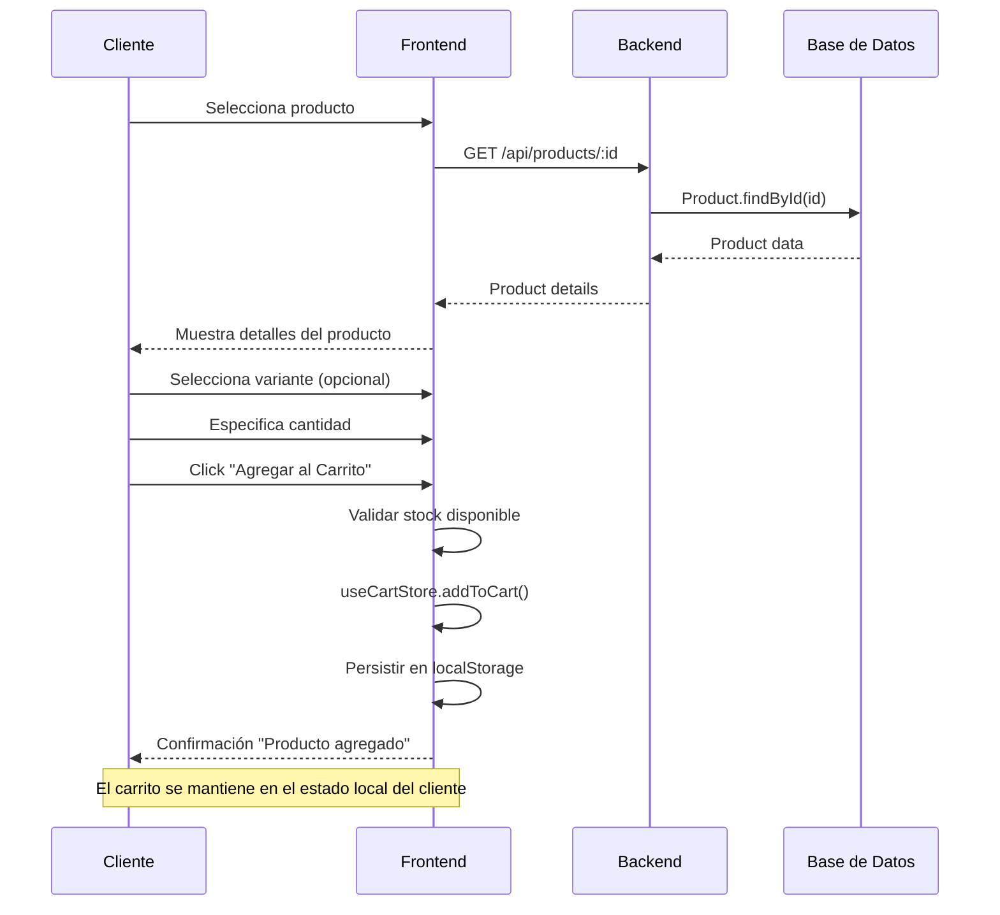
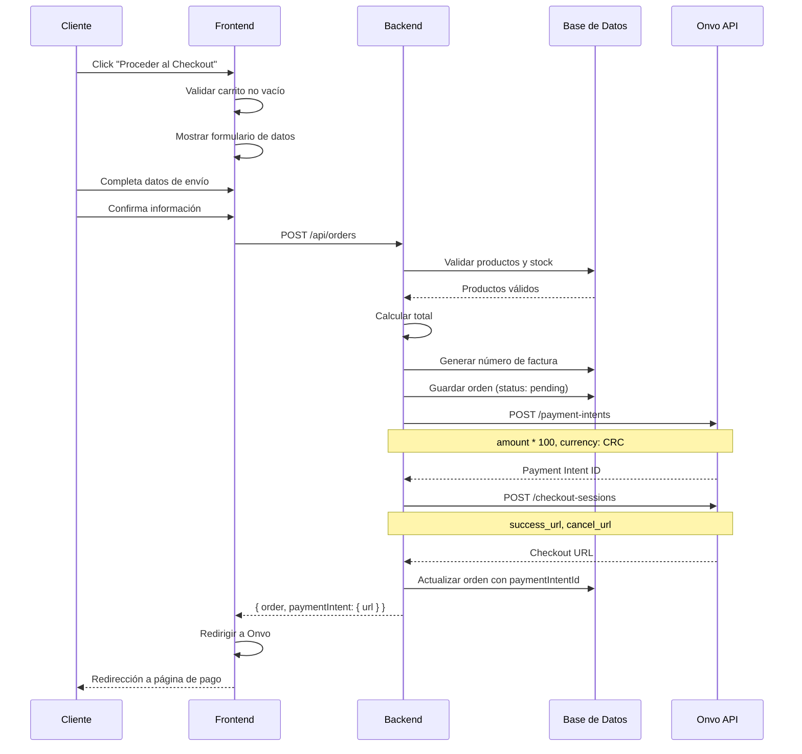
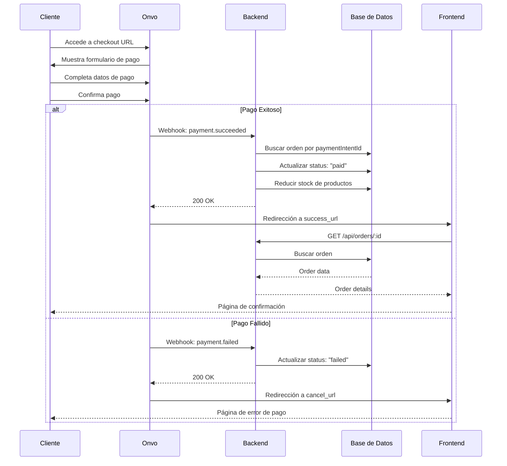
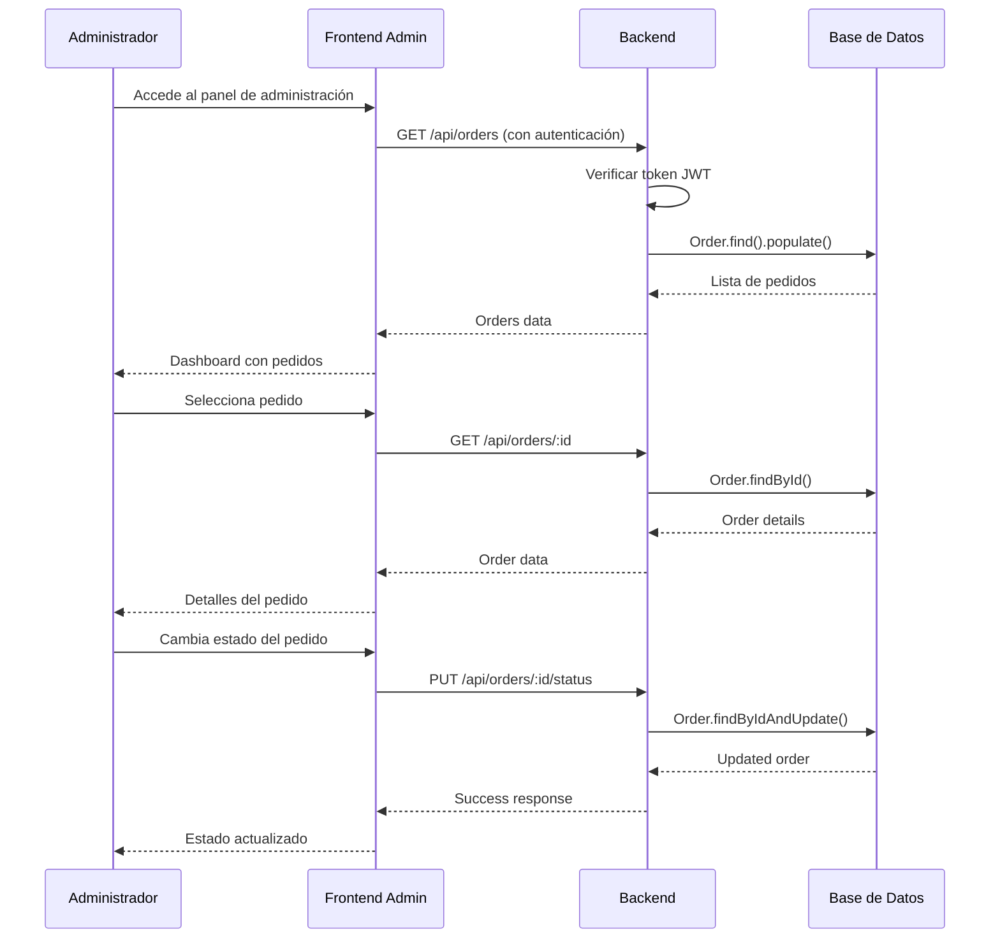
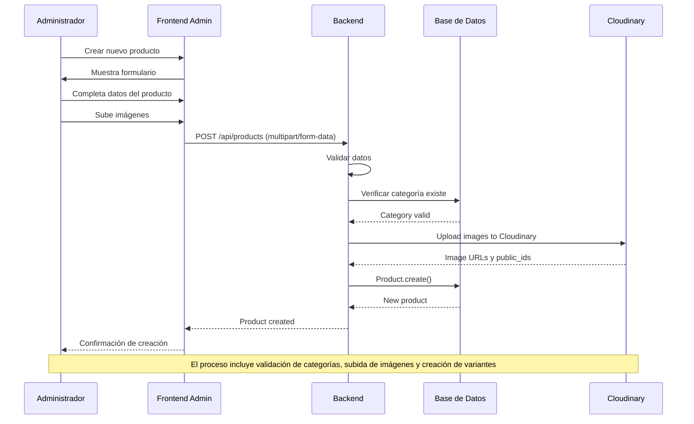
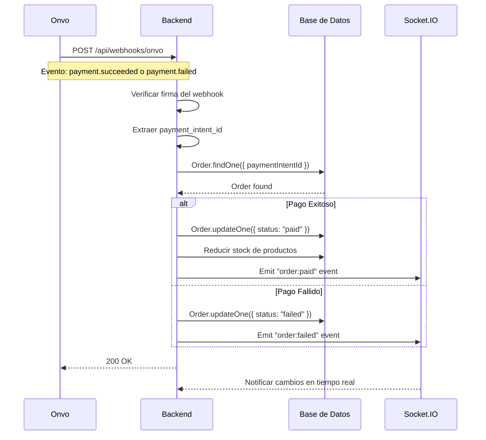

# Diagrama de Secuencia - Parritico Store

## Descripción
Este diagrama muestra los flujos de secuencia principales del sistema: agregar al carrito, checkout y proceso de pago.

## 1. Flujo: Agregar Producto al Carrito

## 2. Flujo: Proceso de Checkout

## 3. Flujo: Proceso de Pago

## 4. Flujo: Gestión de Pedidos (Admin)

## 5. Flujo: Gestión de Productos (Admin)

## 6. Flujo: Webhook de Pago

## Descripción de los Flujos

### Flujo de Compra Completo
1. **Navegación**: Cliente explora productos
2. **Selección**: Agrega productos al carrito
3. **Checkout**: Completa datos de envío
4. **Pago**: Procesa pago con Onvo
5. **Confirmación**: Recibe confirmación de compra
6. **Gestión**: Admin gestiona el pedido

### Puntos de Integración
- **Onvo**: Para procesamiento de pagos
- **Cloudinary**: Para gestión de imágenes
- **Socket.IO**: Para notificaciones en tiempo real
- **JWT**: Para autenticación de administradores

### Manejo de Errores
- Validación de stock antes del pago
- Rollback en caso de fallos
- Webhooks para sincronización de estados
- Notificaciones en tiempo real
