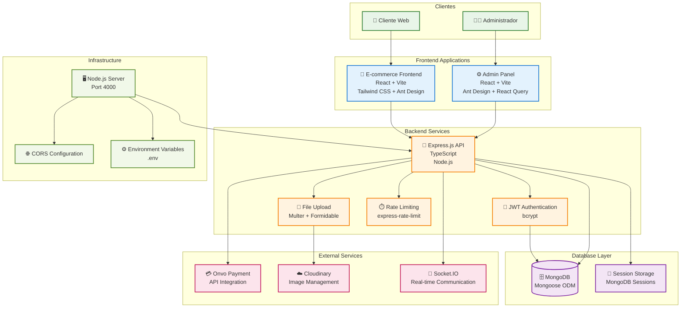

# Diagrama de Arquitectura - Parritico Store

## Descripción
Este diagrama muestra la arquitectura completa del sistema Parritico Store, incluyendo frontend, backend, base de datos e integraciones externas.

## Diagrama



## Arquitectura Detallada

### 🎯 Capa de Presentación (Frontend)

#### E-commerce Frontend
- **Tecnología**: React 19 + Vite + TypeScript
- **UI Framework**: Tailwind CSS + Ant Design
- **Estado**: Zustand para gestión de estado
- **Routing**: React Router DOM
- **Características**:
  - Catálogo de productos
  - Carrito de compras persistente
  - Proceso de checkout
  - Integración con Onvo para pagos

#### Admin Panel
- **Tecnología**: React 19 + Vite + TypeScript
- **UI Framework**: Ant Design + Tailwind CSS
- **Estado**: Zustand + React Query
- **Autenticación**: JWT con jwt-decode
- **Características**:
  - Dashboard administrativo
  - Gestión de productos y categorías
  - Gestión de pedidos
  - Panel de contactos

### 🚀 Capa de Aplicación (Backend)

#### API REST (Express.js)
- **Framework**: Express.js con TypeScript
- **Puerto**: 4000
- **Características**:
  - Arquitectura MVC
  - Middleware de autenticación JWT
  - Validación con express-validator
  - Rate limiting
  - CORS configurado

#### Módulos Principales
- **AuthController**: Autenticación y autorización
- **ProductController**: CRUD de productos
- **OrderController**: Gestión de pedidos
- **PaymentController**: Integración con Onvo
- **CategoryController**: Gestión de categorías
- **ContactController**: Mensajes de contacto

### 🗄️ Capa de Datos

#### MongoDB
- **ODM**: Mongoose
- **Colecciones principales**:
  - Users (administradores)
  - Products (productos con variantes)
  - Categories/SubCategories
  - Orders (pedidos)
  - Contacts (mensajes)

#### Modelos de Datos
- **Product**: Soporte para variantes, imágenes múltiples
- **Order**: Estados de pedido, integración con Onvo
- **User**: Roles de administrador
- **Category**: Jerarquía de categorías

### 🔌 Servicios Externos

#### Onvo (Pagos)
- **Propósito**: Procesamiento de pagos
- **Integración**: API REST + Webhooks
- **Flujo**: Payment Intent → Checkout Session → Webhook
- **Monedas**: CRC (Colones costarricenses)

#### Cloudinary (Imágenes)
- **Propósito**: Gestión de imágenes
- **Características**: Upload, transformación, CDN
- **Integración**: SDK de Node.js
- **Organización**: Carpetas por tipo (products, variants, categories)

#### Socket.IO (Tiempo Real)
- **Propósito**: Notificaciones en tiempo real
- **Eventos**: Cambios de estado de pedidos
- **Configuración**: CORS para múltiples frontends

### 🛡️ Seguridad y Middleware

#### Autenticación
- **JWT**: Tokens con expiración
- **bcrypt**: Hash de contraseñas
- **Roles**: admin, organizer

#### Validación
- **express-validator**: Validación de datos
- **Mongoose**: Validaciones de esquema
- **Sanitización**: Limpieza de inputs

#### Rate Limiting
- **express-rate-limit**: Protección contra abuso
- **Configuración**: Límites por endpoint

### 📁 Estructura del Proyecto

```
parritico/
├── backend-parritico/          # API Backend
│   ├── src/
│   │   ├── controllers/       # Controladores
│   │   ├── models/           # Modelos de datos
│   │   ├── routes/           # Rutas de API
│   │   ├── middleware/       # Middleware personalizado
│   │   ├── config/           # Configuraciones
│   │   └── utils/            # Utilidades
├── ecommerce-parritico/       # Frontend E-commerce
│   ├── src/
│   │   ├── modules/          # Módulos de funcionalidad
│   │   ├── core/             # Servicios base
│   │   └── layouts/          # Componentes de layout
├── front-admin-parritico/     # Panel de Administración
│   ├── src/
│   │   ├── pages/            # Páginas del admin
│   │   └── core/              # Servicios base
└── docs/                      # Documentación
```

### 🔄 Flujo de Datos

1. **Cliente** interactúa con **Frontend**
2. **Frontend** hace requests a **API**
3. **API** valida y procesa datos
4. **API** interactúa con **MongoDB**
5. **API** integra con **servicios externos**
6. **Webhooks** notifican cambios de estado
7. **Socket.IO** actualiza frontends en tiempo real

### 🚀 Despliegue y Configuración

#### Variables de Entorno
- **Database**: MongoDB connection string
- **JWT**: Secret key para tokens
- **Onvo**: API keys y webhook secrets
- **Cloudinary**: Cloud name, API key, secret
- **CORS**: URLs permitidas para frontends

#### Puertos y URLs
- **Backend**: http://localhost:4000
- **E-commerce**: http://localhost:5173
- **Admin Panel**: http://localhost:5174
- **MongoDB**: mongodb://localhost:27017/parritico
