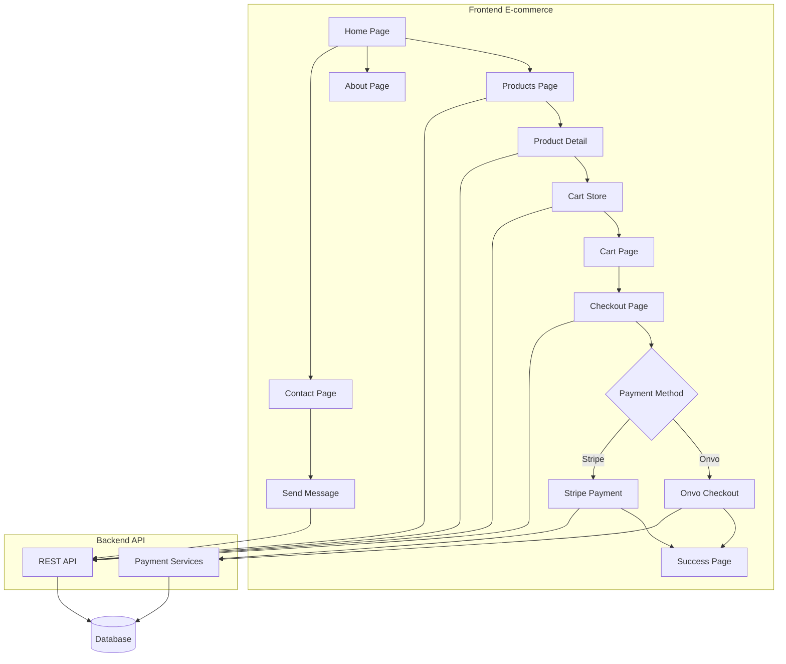
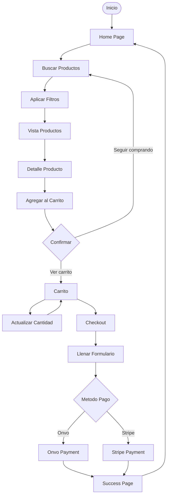
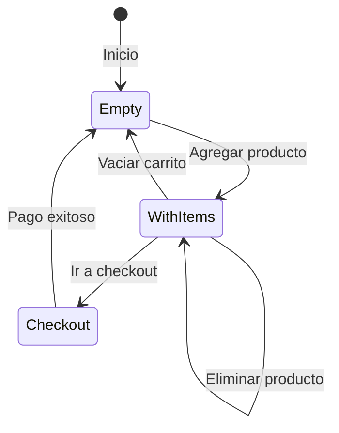
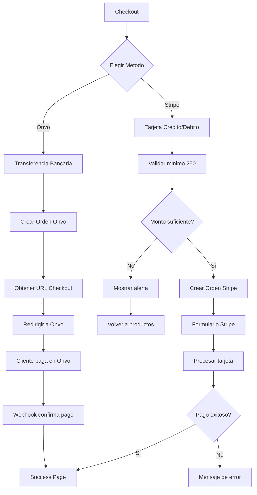

# Resumen de Casos de Uso - E-commerce Parrítico

## Índice de Casos de Uso

Este documento contiene la documentación completa de los casos de uso del e-commerce público de Parrítico:

### 1. [Navegación y Vistas](./01_Navegacion_Vistas.md)
- Página de inicio (Home)
- Vista de productos
- Vista de producto individual
- Página sobre nosotros
- Página de contacto

### 2. [Gestión de Carrito](./02_Gestion_Carrito.md)
- Agregar productos al carrito
- Ver carrito
- Actualizar cantidad
- Eliminar productos
- Persistencia del carrito

### 3. [Proceso de Checkout](./03_Proceso_Checkout.md)
- Formulario de checkout
- Resumen de pedido
- Selección de método de pago

### 4. [Proceso de Pago](./04_Proceso_Pago.md)
- Pago con Onvo (Transferencia bancaria)
- Pago con Stripe (Tarjeta)
- Validación de montos mínimos
- Confirmación de pago exitoso

### 5. [Contacto](./05_Contacto.md)
- Envío de mensaje de contacto
- Validación de formulario
- Confirmación de envío

## Arquitectura del Sistema

## Roles del Sistema

### 🌐 Cliente Público
Acceso a todas las funcionalidades del e-commerce:
- Navegar productos
- Ver detalles
- Agregar al carrito
- Realizar compra
- Contactar soporte

## Tecnologías Principales

- **Frontend Framework**: React 19 con TypeScript
- **UI Library**: Ant Design 5
- **State Management**: Zustand con persistencia
- **Routing**: React Router v7
- **Pagos**: Onvo & Stripe
- **Build Tool**: Vite
- **Styling**: TailwindCSS

## Flujo de Compra Principal

## Estado del Carrito

## Métodos de Pago

## Estructura de Datos

### Producto
- Información básica (nombre, descripción, precio base)
- Categoría y subcategoría
- Imágenes
- Variantes (color, talla, stock por variante)
- Stock general

### Carrito
- Lista de items
- Producto + Variante (opcional) + Cantidad
- Persistencia en localStorage

### Orden
- Información del cliente
- Dirección de envío
- Items (productos y variantes)
- Método de pago seleccionado
- Total a pagar

## Integraciones Externas

### Onvo
- Plataforma de pagos bancarios
- Transferencia en línea
- Webhooks para confirmación

### Stripe
- Procesador de tarjetas
- Validación de montos
- Formulario seguro de pago

## Patrones de Diseño Utilizados

1. **State Management**: Zustand con persistencia
2. **Cart Persistence**: localStorage
3. **Payment Gateways**: Onvo & Stripe integrados
4. **Responsive Design**: TailwindCSS
5. **Component Reusability**: Layout compartido

