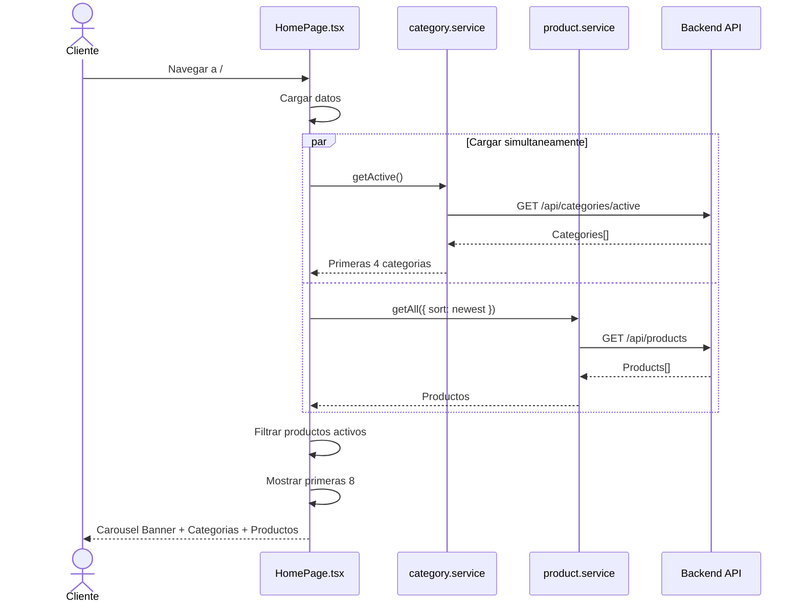
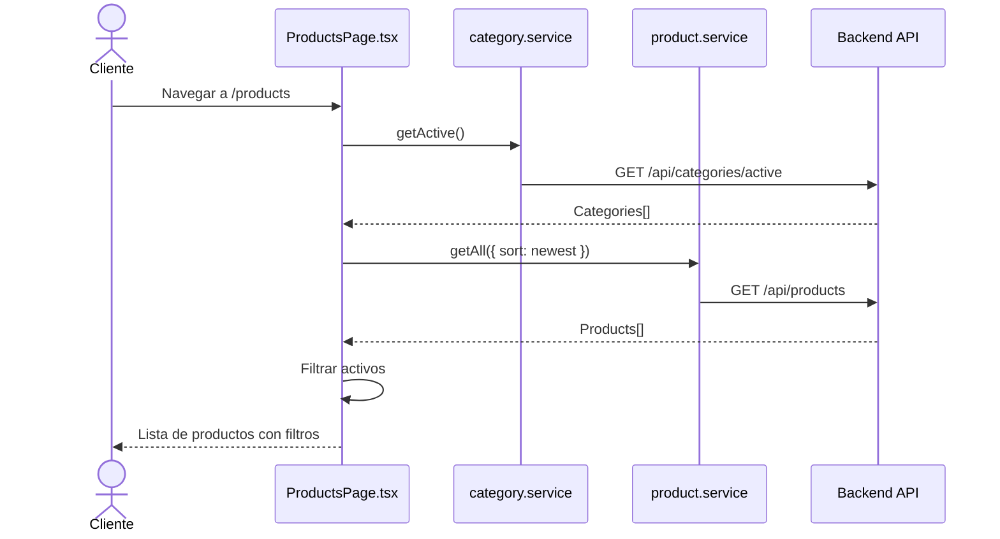
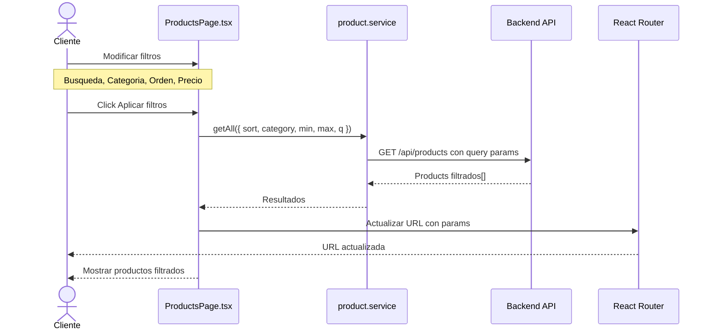
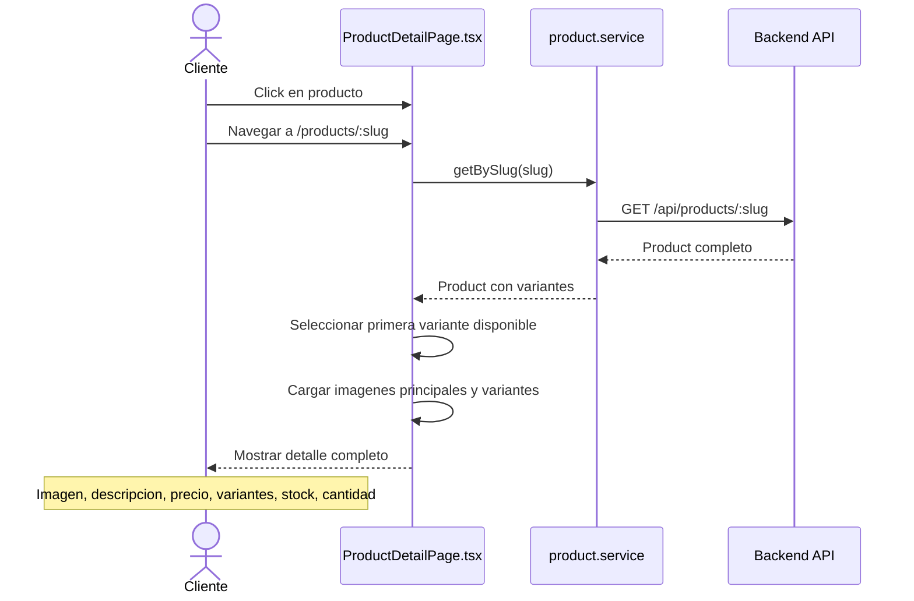
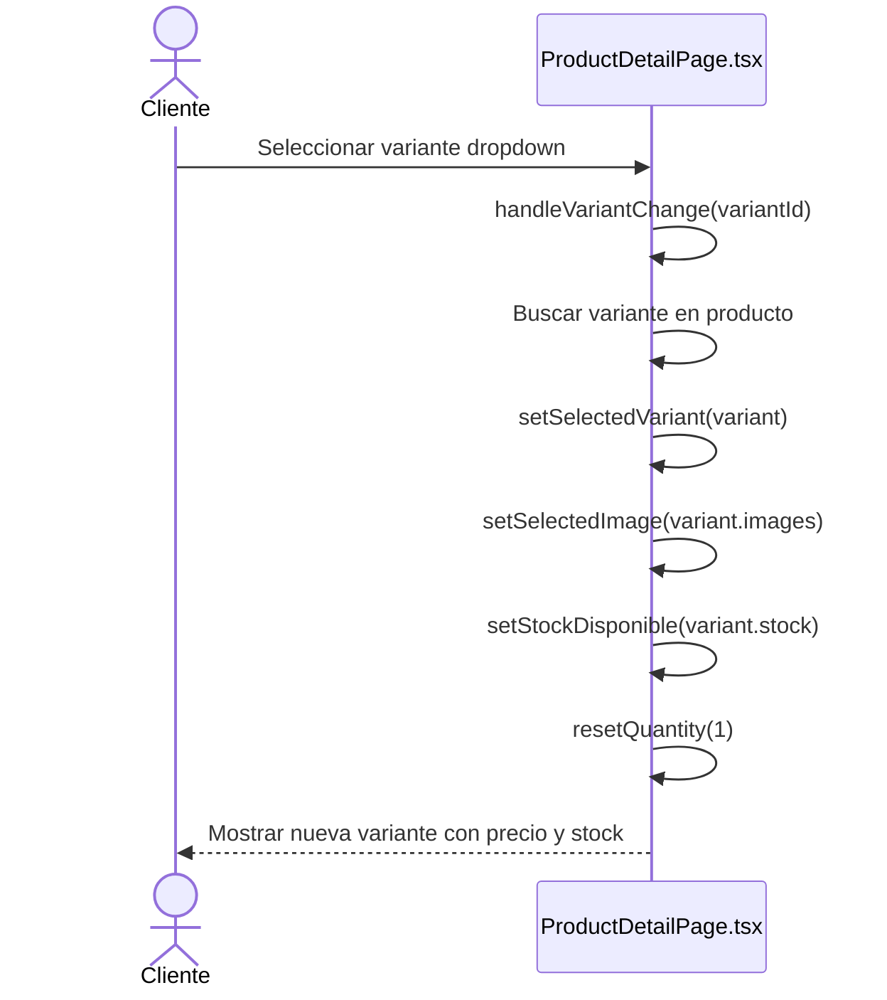
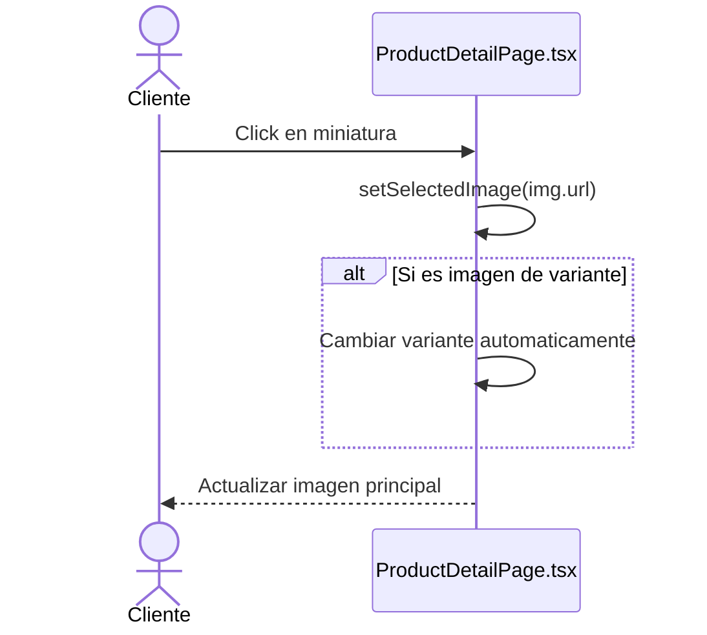
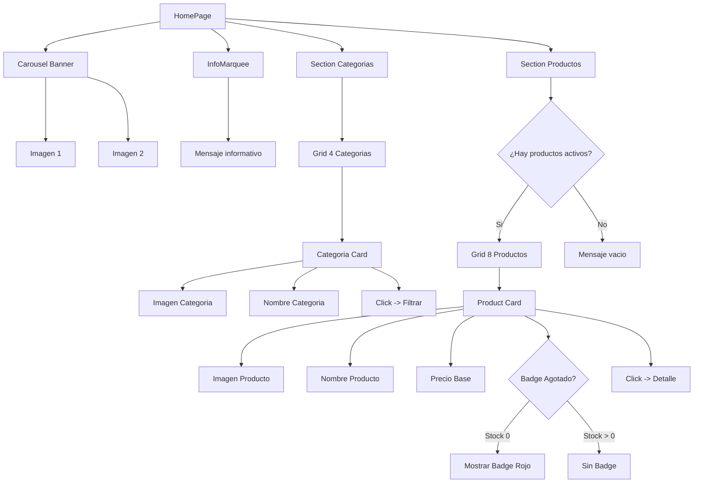
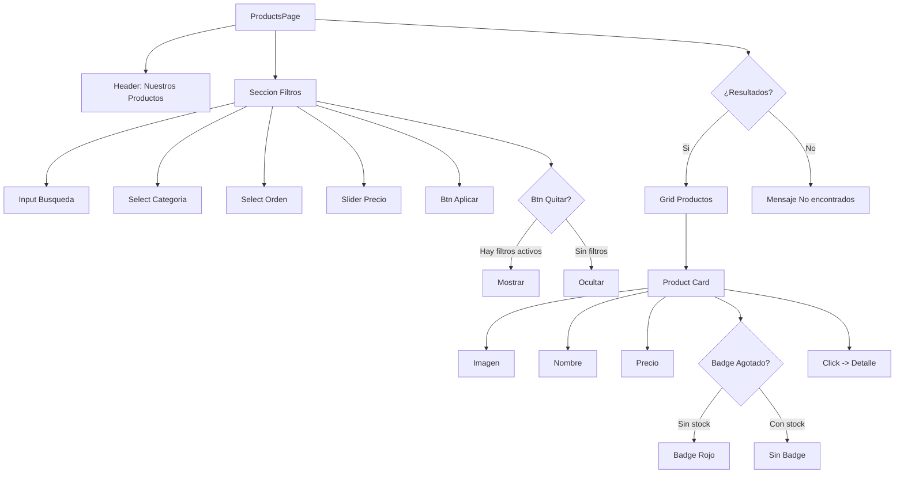
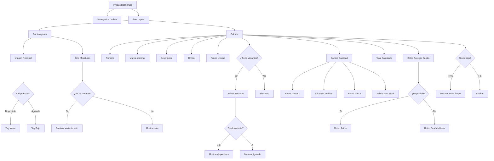

# Diagrama de Caso de Uso: Navegación y Vistas

## 1. Página de Inicio (Home)

## 2. Vista de Productos

## 3. Aplicar Filtros de Productos

## 4. Vista de Detalle de Producto

## 5. Cambiar Variante de Producto

## 6. Cambiar Imagen de Vista Previa

## Estructura de Página Home

## Estructura de ProductsPage

## Estructura de ProductDetailPage

