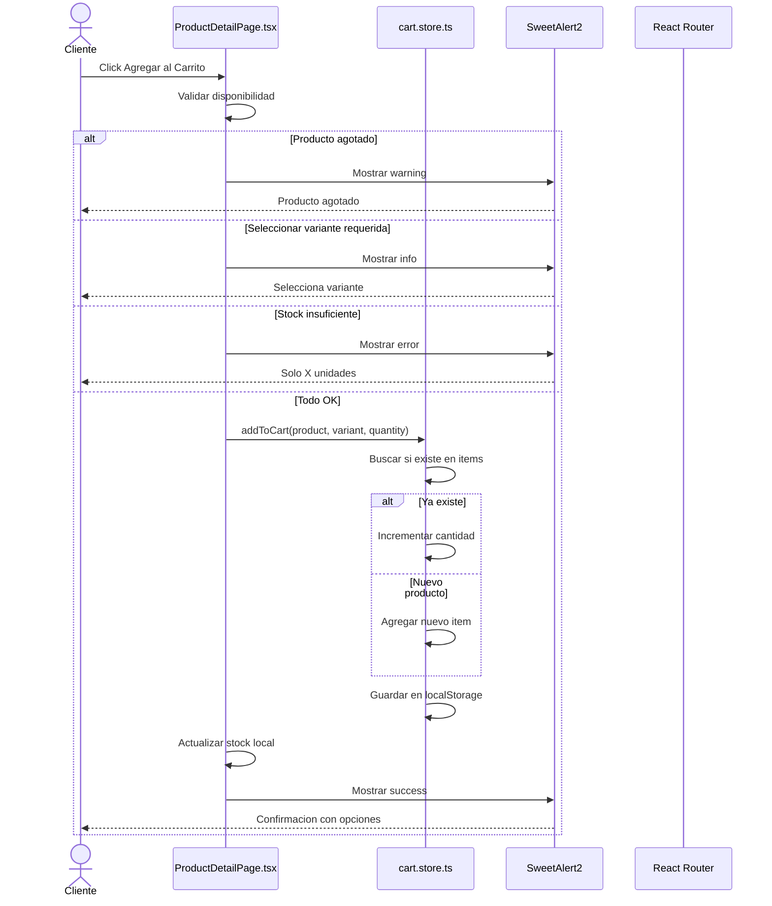
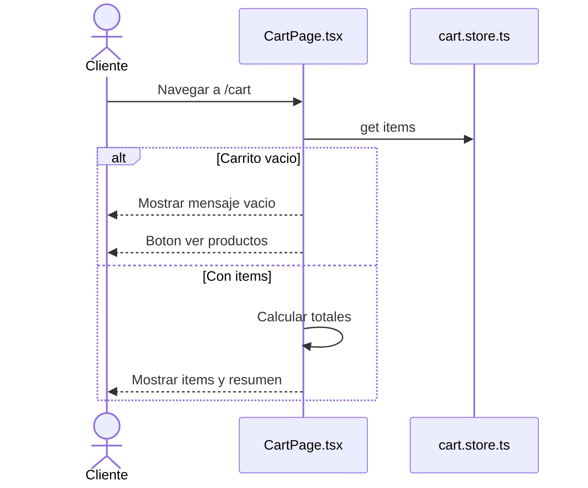
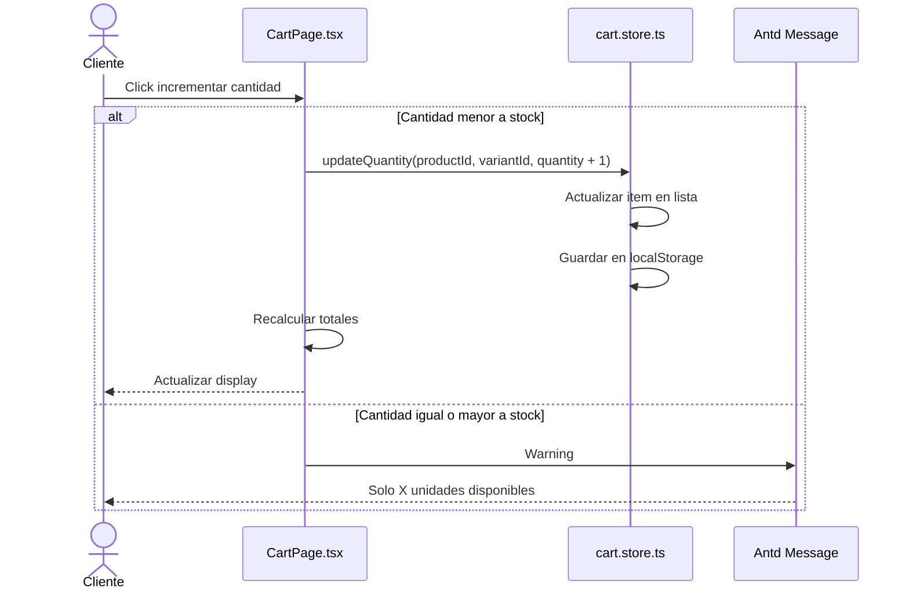
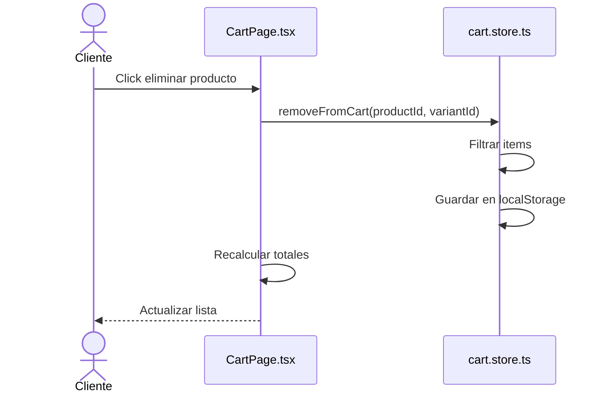
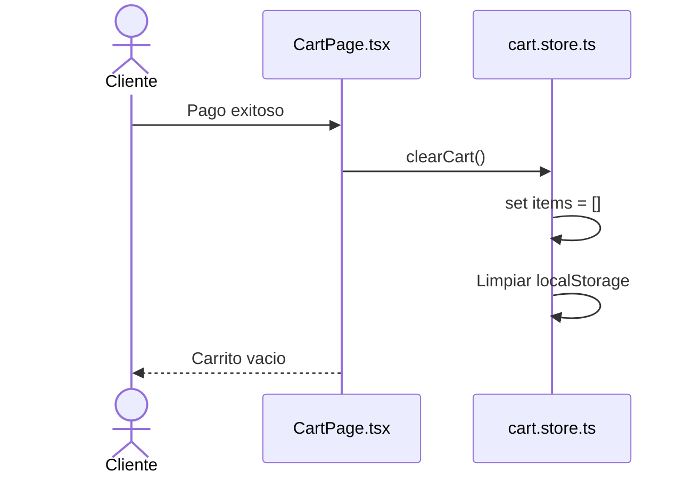
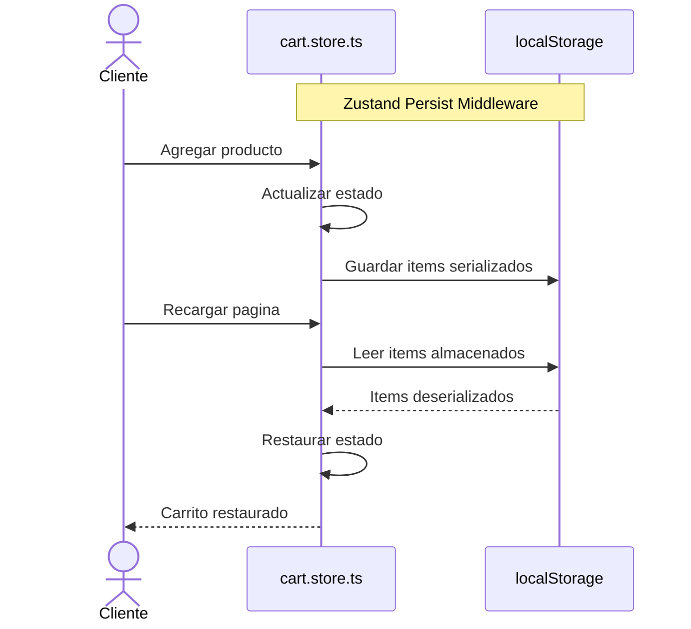
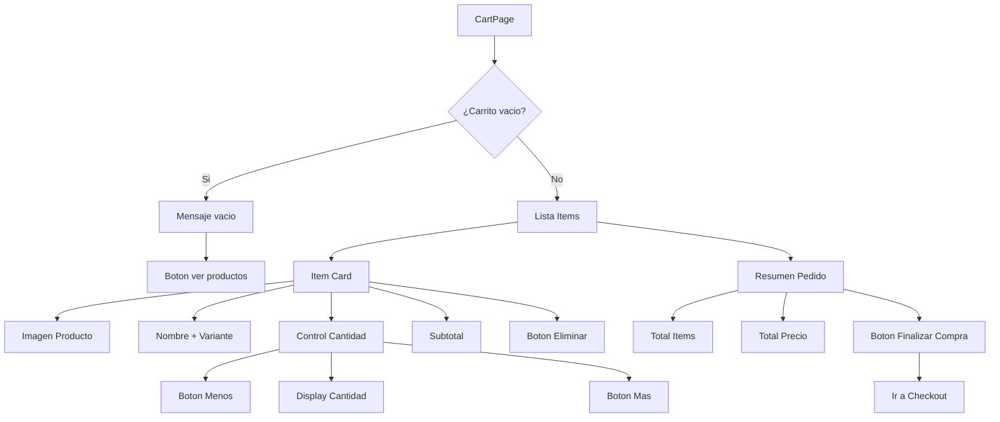
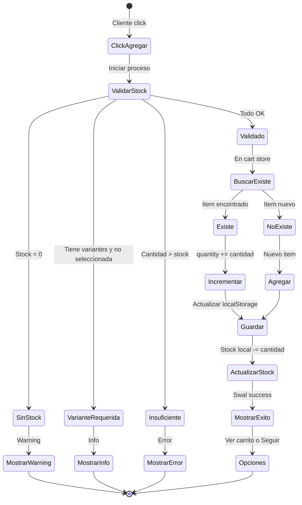
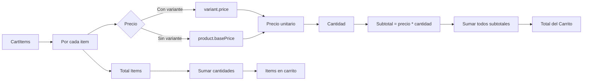

# Diagrama de Caso de Uso: Gestión de Carrito

## 1. Agregar Producto al Carrito



## 2. Ver Carrito



## 3. Actualizar Cantidad en Carrito



## 4. Eliminar Producto del Carrito



## 5. Limpiar Carrito Completo



## Persistencia del Carrito



## Estado del Carrito

```mermaid
graph TD
    A[CartStore] --> B[State]
    B --> C[items: CartItem[]]
    
    C --> D[CartItem]
    D --> E[product: Product]
    D --> F[variant?: Variant]
    D --> G[quantity: number]
    
    A --> H[Actions]
    H --> I[addToCart]
    H --> J[removeFromCart]
    H --> K[updateQuantity]
    H --> L[clearCart]
    
    I --> M{¿Existe?}
    M -->|Si| N[Incrementar cantidad]
    M -->|No| O[Agregar nuevo]
    
    J --> P[Filtrar items]
    K --> Q[Actualizar item]
    L --> R[Vaciar items]
    
    N --> S[localStorage]
    O --> S
    P --> S
    Q --> S
    R --> S
```

## Vista de Carrito



## Flujo de Agregado al Carrito



## Cálculo de Totales



