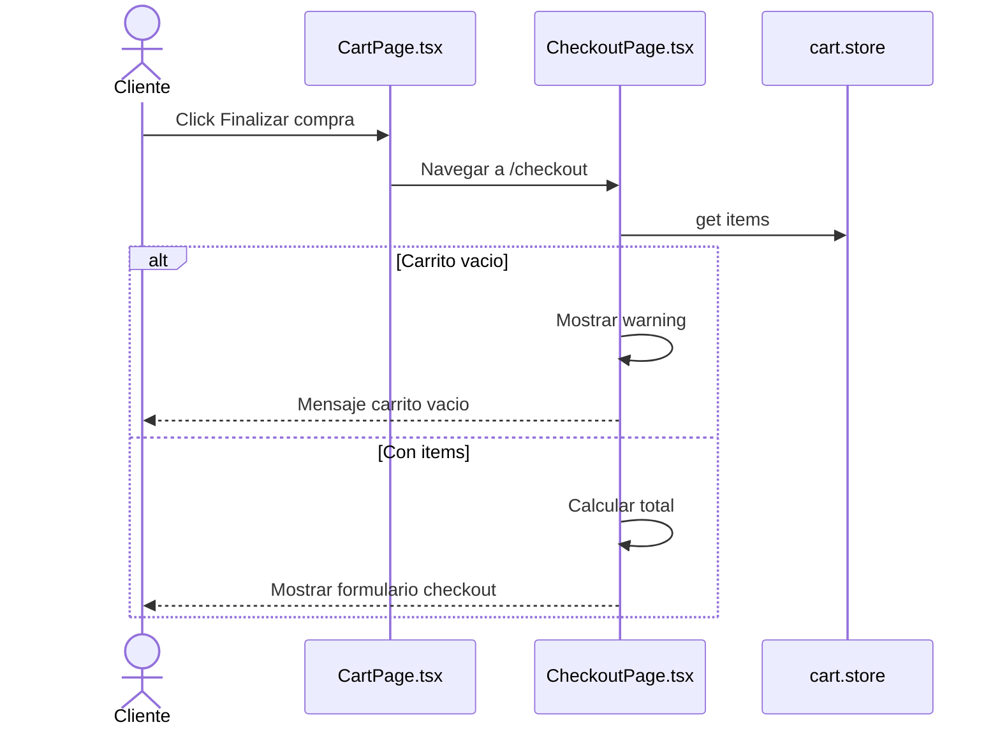
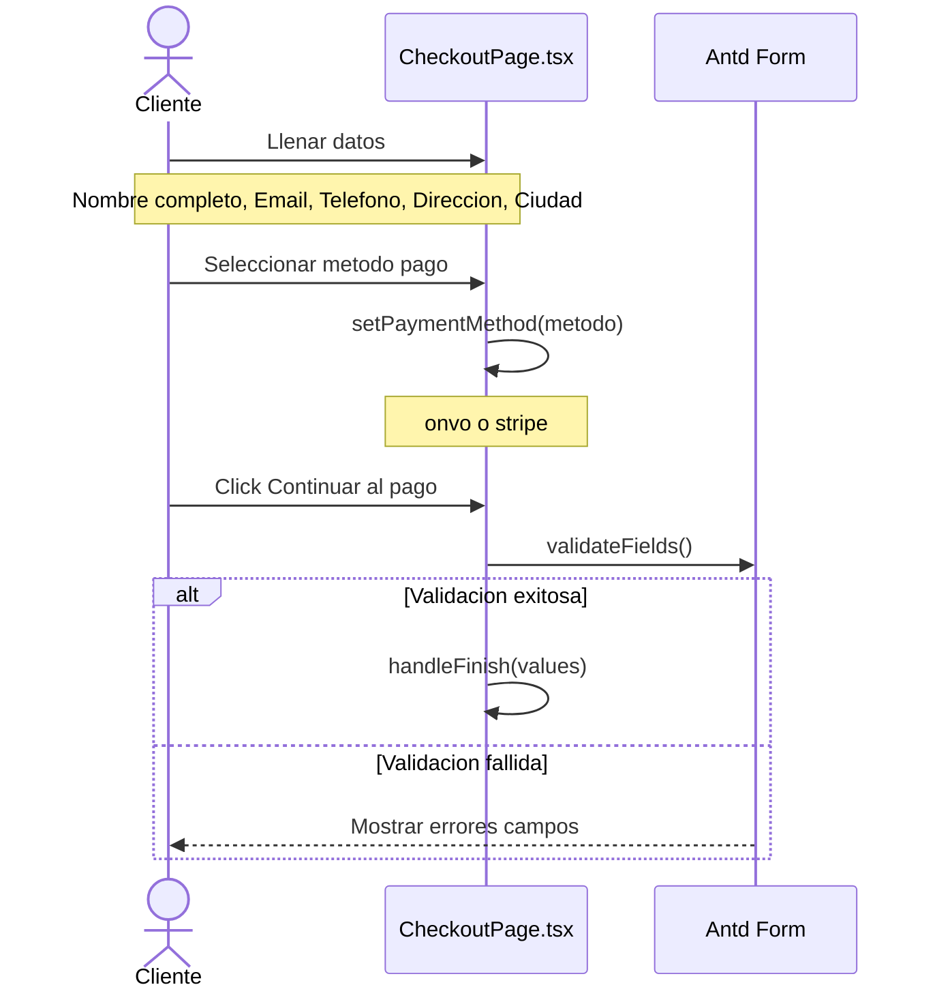
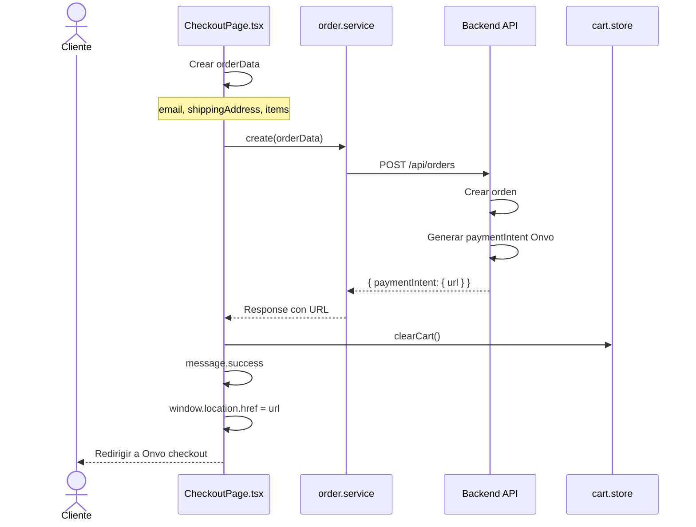
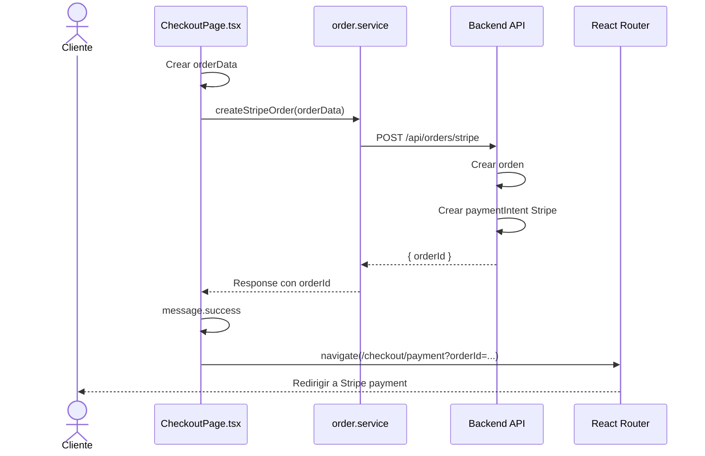
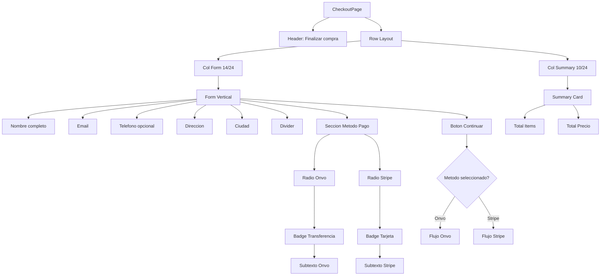
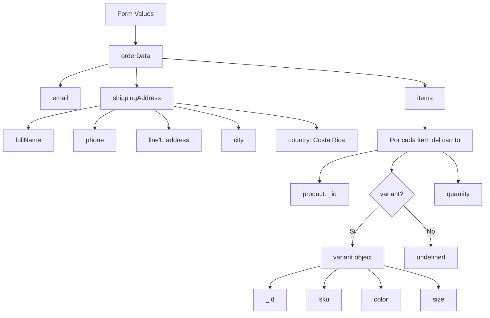
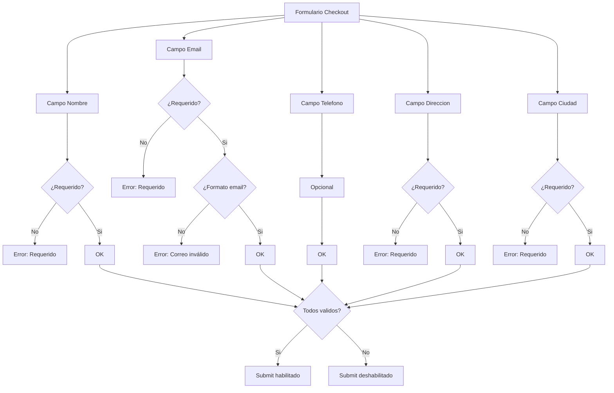
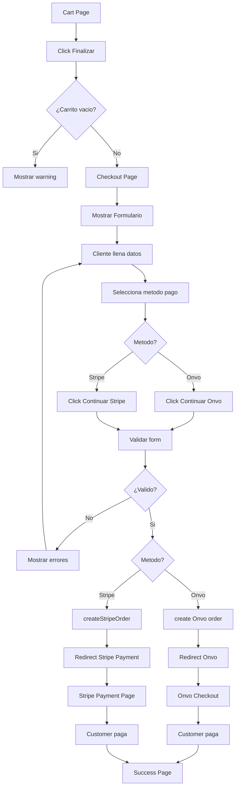

# Diagrama de Caso de Uso: Proceso de Checkout

## 1. Iniciar Checkout



## 2. Llenar Formulario de Checkout



## 3. Procesar Checkout - Onvo



## 4. Procesar Checkout - Stripe



## Estructura de CheckoutPage



## Selección de Método de Pago

```mermaid
stateDiagram-v2
    [*] --> Default: Inicio
    Default --> Onvo: onvo seleccionado por defecto
    
    Onvo --> Stripe: Cliente click Stripe
    Stripe --> Onvo: Cliente click Onvo
    
    Onvo --> SubmitOnvo: Submit form
    Stripe --> SubmitStripe: Submit form
    
    SubmitOnvo --> ProcessOnvo: Crear orden Onvo
    ProcessOnvo --> RedirectOnvo: Redirigir a Onvo
    
    SubmitStripe --> ProcessStripe: Crear orden Stripe
    ProcessStripe --> RedirectStripe: Redirigir a payment
    
    RedirectOnvo --> [*]
    RedirectStripe --> [*]
```

## Construcción de OrderData



## Validaciones del Formulario



## Flujo de Checkout Completo



