# Diagrama de Caso de Uso: Proceso de Pago

## 1. Pago con Onvo

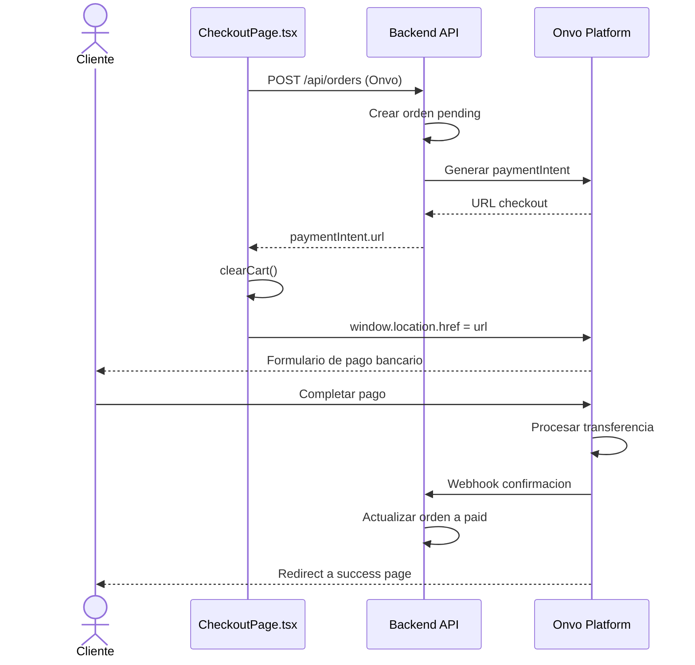

## 2. Pago con Stripe - Cargar Página

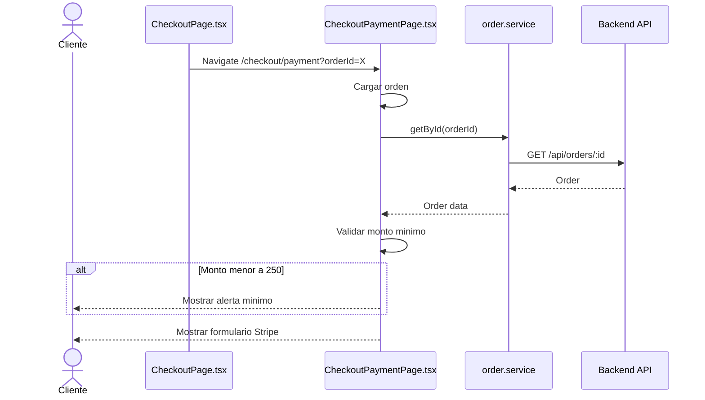

## 3. Procesar Pago con Stripe

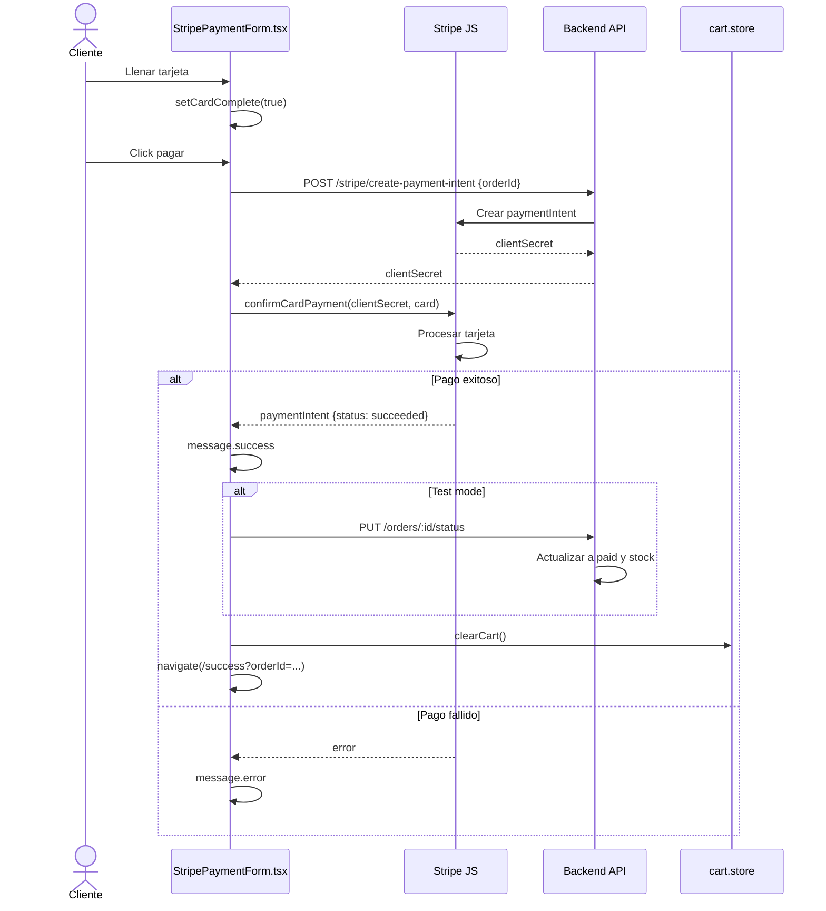

## 4. Página de Éxito

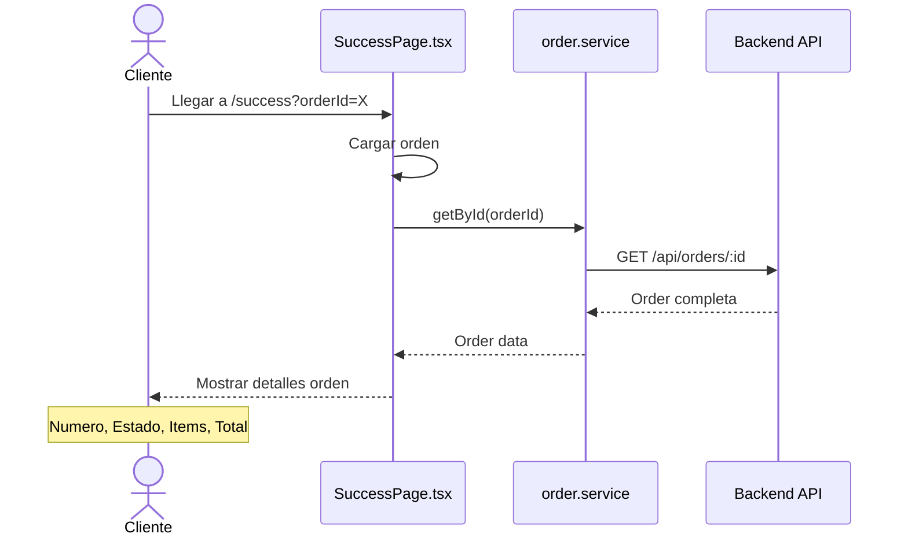

## Flujo de Pago Onvo

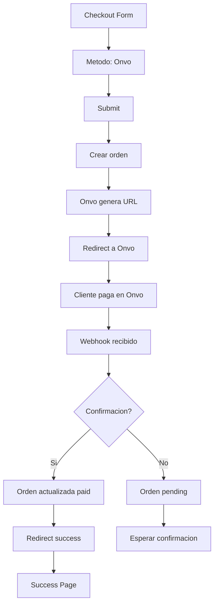

## Flujo de Pago Stripe

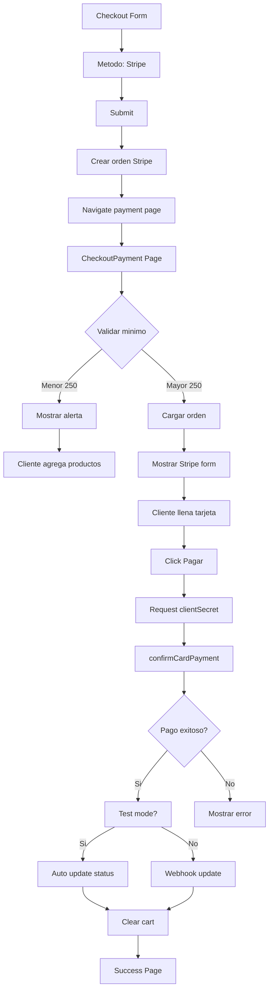

## Validación de Monto Mínimo Stripe

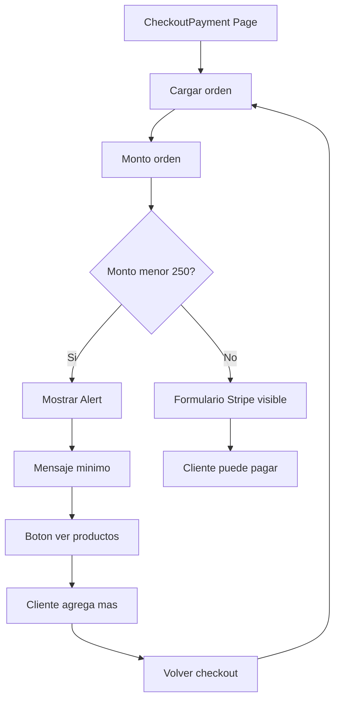

## Estado de Orden

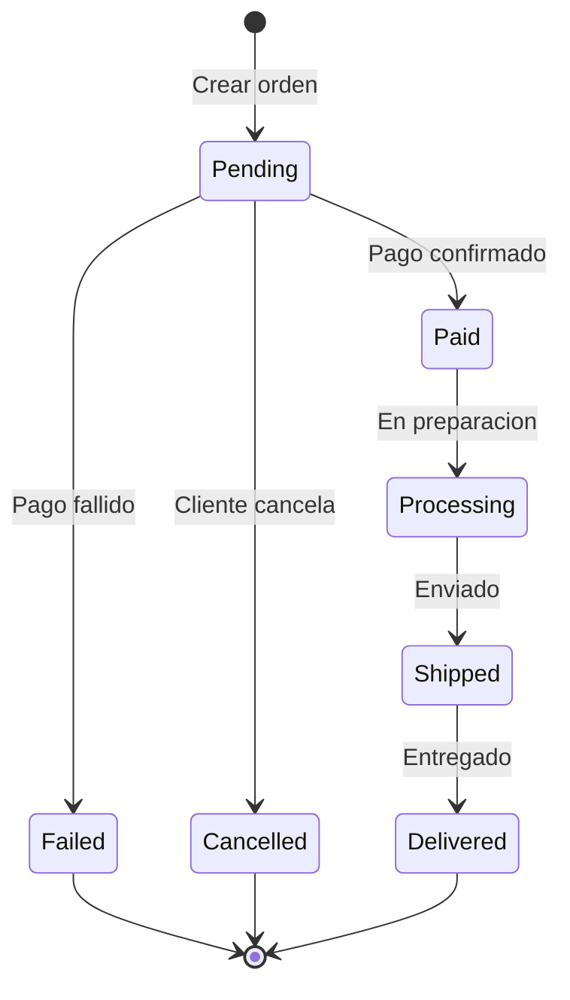

## Webhook Onvo

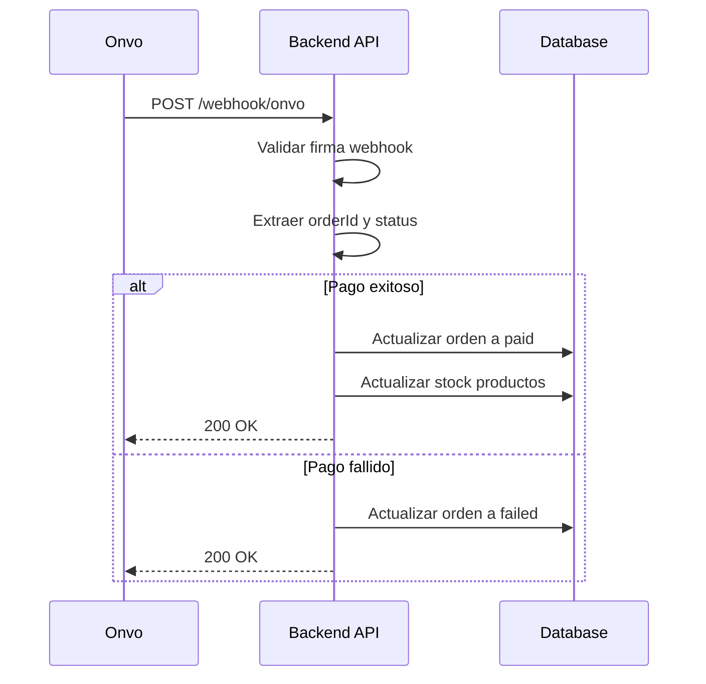

## Test Mode Stripe

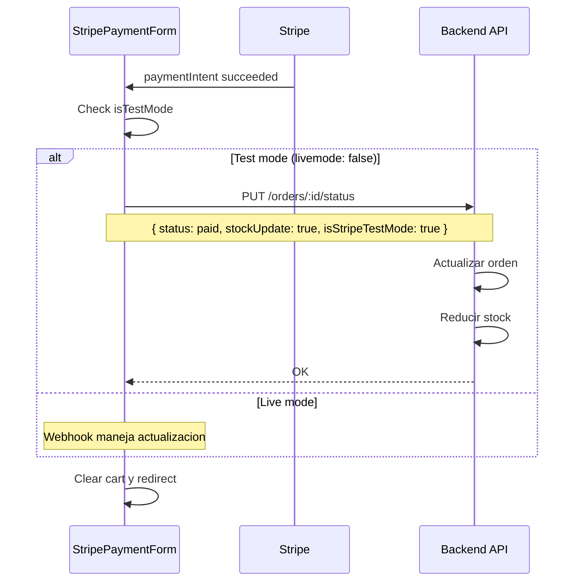

## Success Page - Información Mostrada

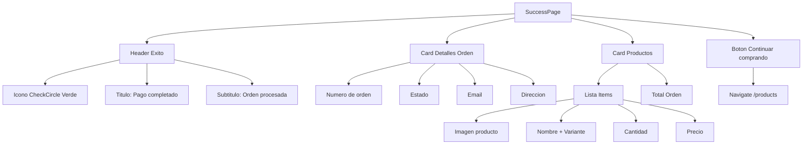

