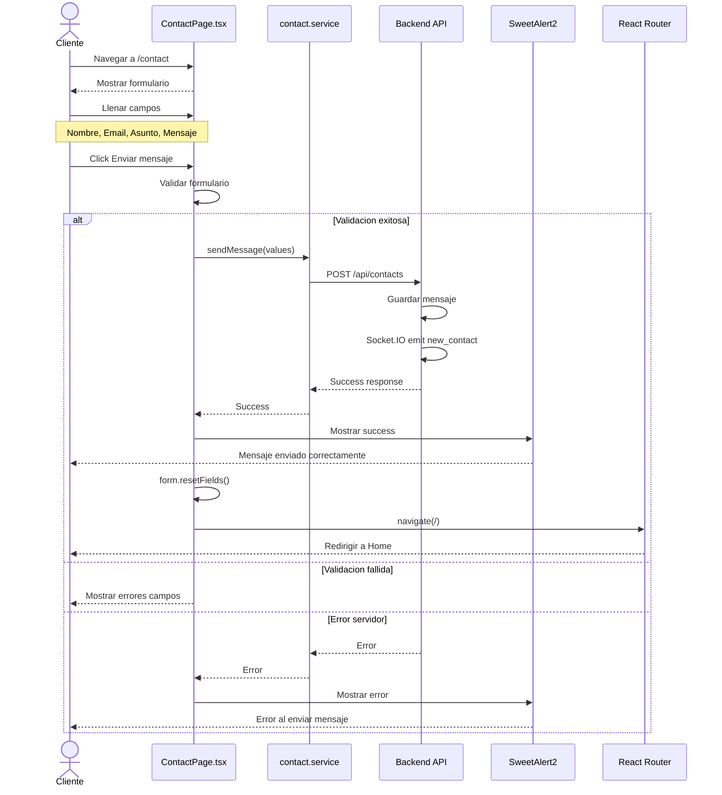
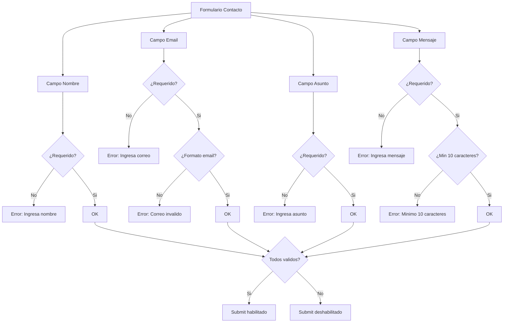
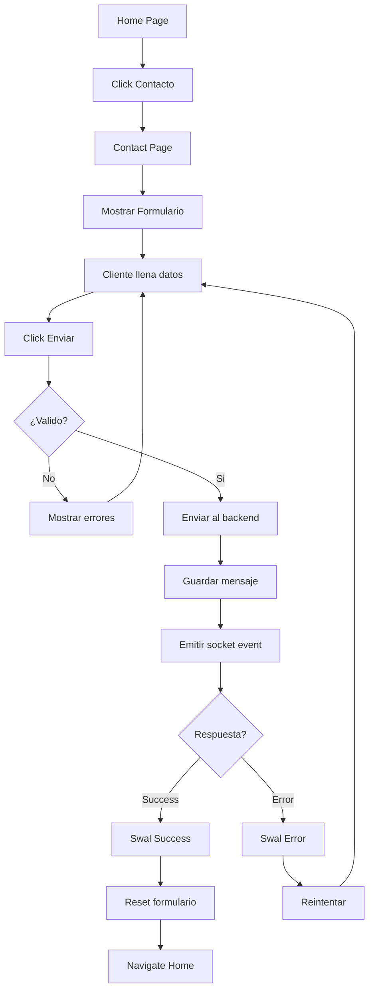
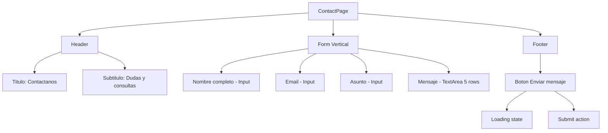
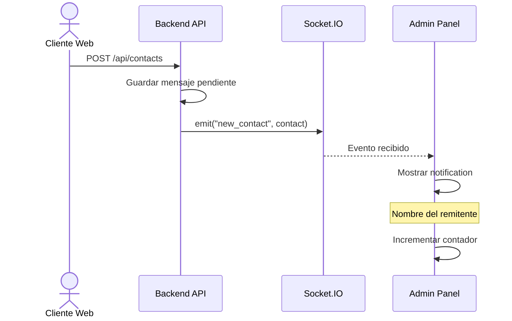
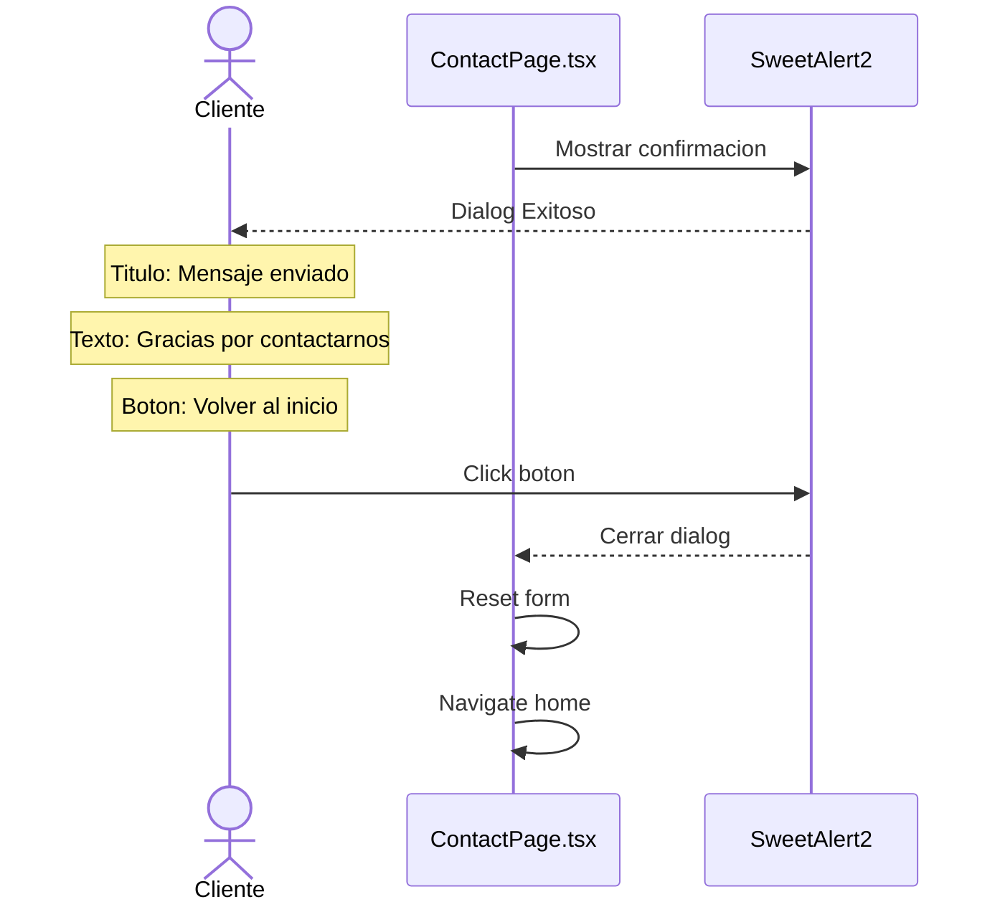
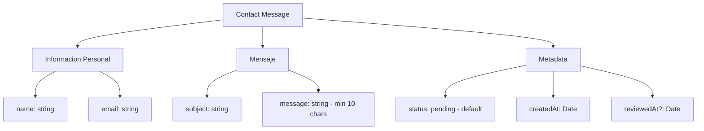
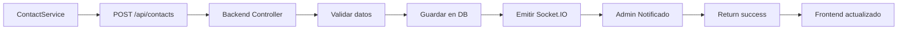
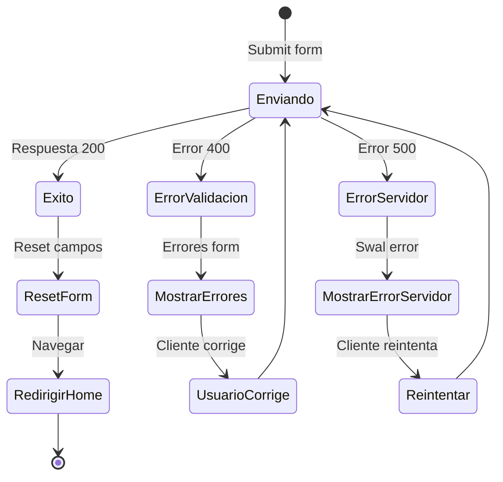

# Diagrama de Caso de Uso: Contacto

## 1. Enviar Mensaje de Contacto

## Validaciones del Formulario

## Flujo Completo de Contacto

## Estructura de ContactPage

## Notificación en Tiempo Real

## Confirmación de Envío

## Estructura de Datos del Mensaje

## Integración con Backend

## Flujo de Errores

