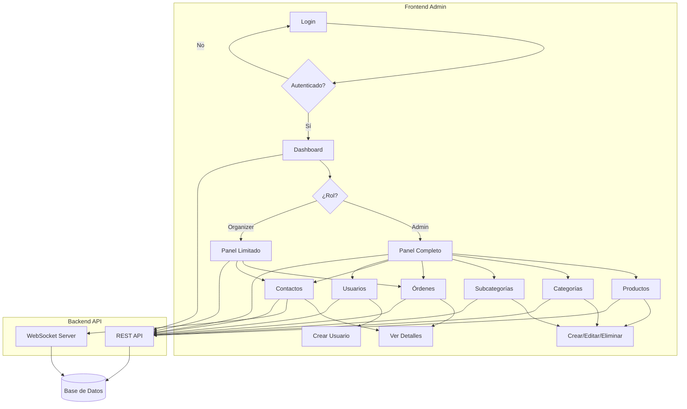
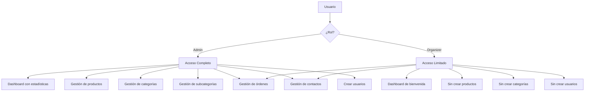
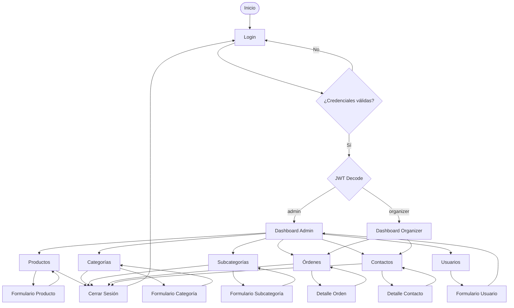
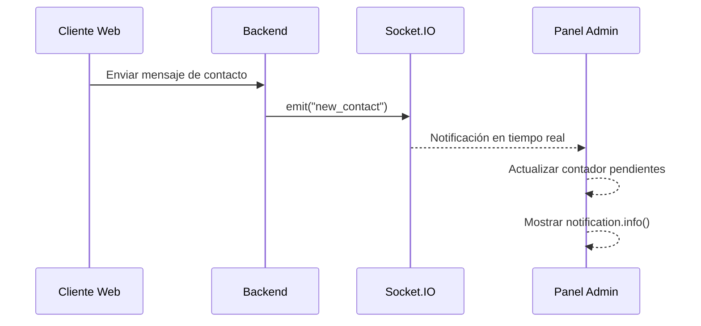

# Resumen de Casos de Uso - Panel Administrativo

## Índice de Casos de Uso

Este documento contiene la documentación completa de los casos de uso del panel administrativo de Parrítico:

### 1. [Autenticación](./01_Autenticacion.md)
- Iniciar sesión (Login)
- Cerrar sesión (Logout)
- Control de acceso con guards

### 2. [Dashboard](./02_Dashboard.md)
- Ver estadísticas generales (Admin)
- Ver bienvenida personalizada (Organizer)
- Visualizar última actividad

### 3. [Gestión de Productos](./03_Gestion_Productos.md)
- Listar productos (activos/inactivos)
- Crear producto con variantes e imágenes
- Editar producto
- Activar/Desactivar producto
- Eliminar producto permanentemente

### 4. [Gestión de Categorías](./04_Gestion_Categorias.md)
- Listar categorías
- Crear categoría con imagen
- Editar categoría
- Activar/Desactivar categoría
- Eliminar categoría en cascada

### 5. [Gestión de Subcategorías](./05_Gestion_Subcategorias.md)
- Listar subcategorías
- Crear subcategoría asociada a categoría padre
- Editar subcategoría
- Activar/Desactivar subcategoría
- Eliminar subcategoría en cascada

### 6. [Gestión de Órdenes](./06_Gestion_Ordenes.md)
- Listar órdenes por estado
- Ver detalle completo de orden
- Filtrar por estados según rol
- Tracking de envíos

### 7. [Gestión de Contactos](./07_Gestion_Contactos.md)
- Listar mensajes de contacto
- Ver detalle de mensaje
- Marcar como revisado
- Eliminar contacto
- Notificaciones en tiempo real

### 8. [Gestión de Usuarios](./08_Gestion_Usuarios.md)
- Crear nuevo usuario (Solo Admin)
- Asignar roles (admin/organizer)

## Arquitectura del Sistema

## Roles y Permisos

## Tecnologías Principales

- **Frontend Framework**: React 19 con TypeScript
- **UI Library**: Ant Design 5
- **State Management**: Zustand
- **Data Fetching**: React Query (TanStack Query)
- **Routing**: React Router v7
- **Notifications**: Socket.IO Client
- **Alerts**: SweetAlert2
- **Build Tool**: Vite

## Flujo de Navegación Principal

## Integraciones

### Socket.IO - Notificaciones en Tiempo Real

## Estados Principales

### Producto
- `isActive`: true/false
- Estados de visualización: Activo/Inactivo

### Categoría
- `isActive`: true/false
- Relación: 1:N con Subcategorías

### Subcategoría
- `isActive`: true/false
- Relación: N:1 con Categoría, 1:N con Productos

### Orden
- Estados: `pending`, `paid`, `failed`, `processing`, `shipped`, `delivered`, `cancelled`

### Contacto
- Estados: `pending`, `reviewed`

### Usuario
- Roles: `admin`, `organizer`

## Patrones de Diseño Utilizados

1. **Container/Presenter**: Separación lógica en componentes
2. **Custom Hooks**: Reutilización de lógica (useSlug, etc.)
3. **State Management**: Zustand para estado global
4. **Query Management**: React Query para cache y sincronización
5. **Route Guards**: Protección de rutas basada en autenticación
6. **Real-time Updates**: Socket.IO para notificaciones

