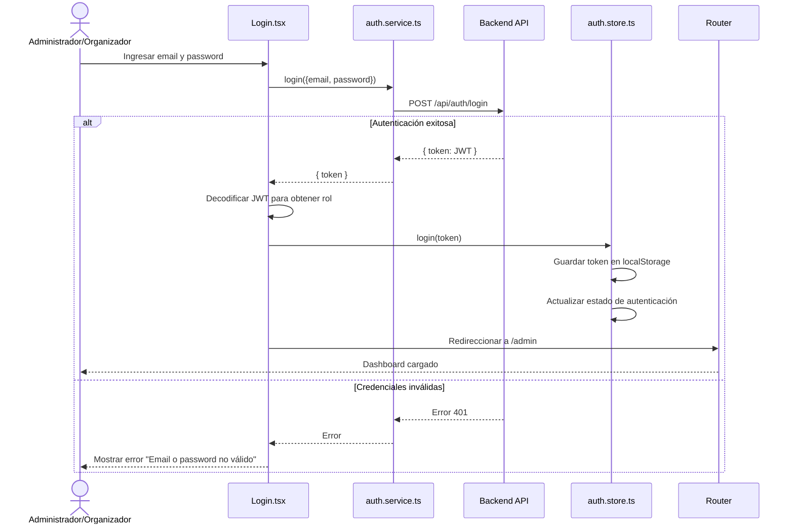
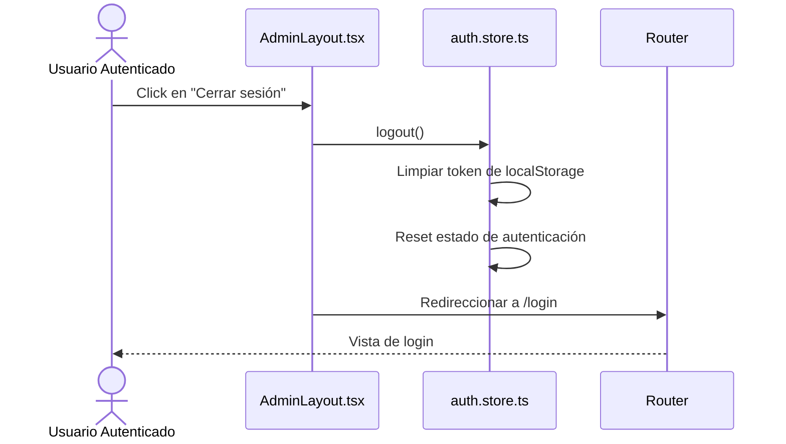
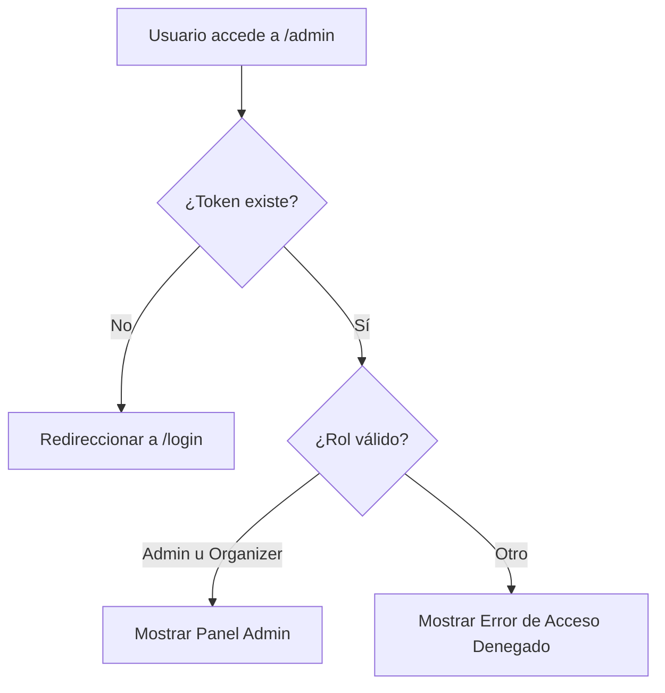

# Diagrama de Caso de Uso: Autenticación

## 1. Iniciar Sesión

```mermaid
sequenceDiagram
    actor Administrador as Administrador/Organizador
    participant Login as Login.tsx
    participant AuthService as auth.service.ts
    participant Backend as Backend API
    participant AuthStore as auth.store.ts
    participant Navigate as Router
    
    Administrador->>Login: Ingresar email y password
    Login->>AuthService: login({email, password})
    AuthService->>Backend: POST /api/auth/login
    
    alt Autenticación exitosa
        Backend-->>AuthService: { token: JWT }
        AuthService-->>Login: { token }
        Login->>Login: Decodificar JWT para obtener rol
        Login->>AuthStore: login(token)
        AuthStore->>AuthStore: Guardar token en localStorage
        AuthStore->>AuthStore: Actualizar estado de autenticación
        Login->>Navigate: Redireccionar a /admin
        Navigate-->>Administrador: Dashboard cargado
    else Credenciales inválidas
        Backend-->>AuthService: Error 401
        AuthService-->>Login: Error
        Login-->>Administrador: Mostrar error "Email o password no válido"
    end
```

## 2. Cerrar Sesión

```mermaid
sequenceDiagram
    actor Usuario as Usuario Autenticado
    participant Layout as AdminLayout.tsx
    participant AuthStore as auth.store.ts
    participant Navigate as Router
    
    Usuario->>Layout: Click en "Cerrar sesión"
    Layout->>AuthStore: logout()
    AuthStore->>AuthStore: Limpiar token de localStorage
    AuthStore->>AuthStore: Reset estado de autenticación
    Layout->>Navigate: Redireccionar a /login
    Navigate-->>Usuario: Vista de login
```

## Flujo de Guard AdminRoute

```mermaid
graph TD
    A[Usuario accede a /admin] --> B{¿Token existe?}
    B -->|No| C[Redireccionar a /login]
    B -->|Sí| D{¿Rol válido?}
    D -->|Admin u Organizer| E[Mostrar Panel Admin]
    D -->|Otro| F[Mostrar Error de Acceso Denegado]
```

