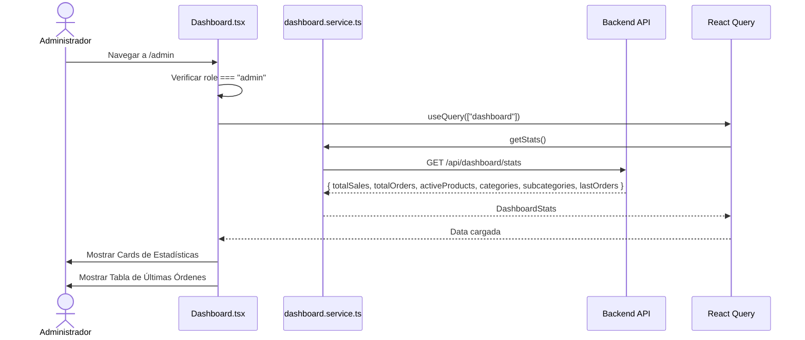
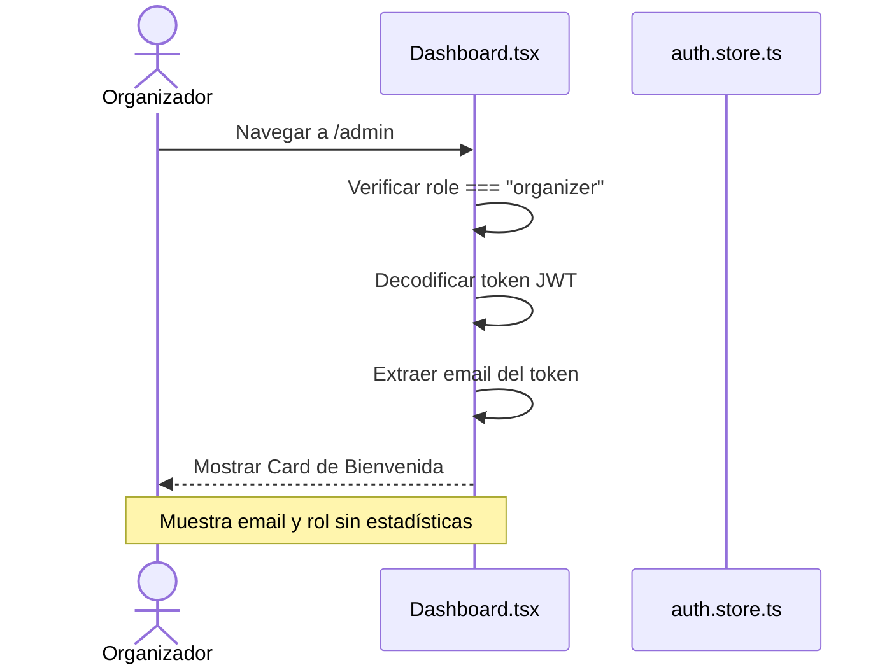
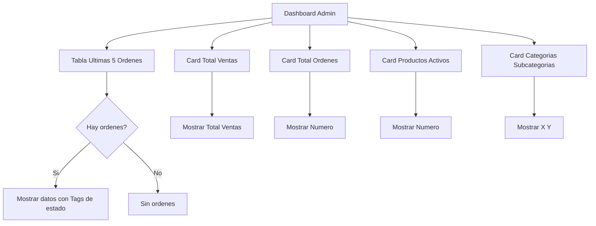
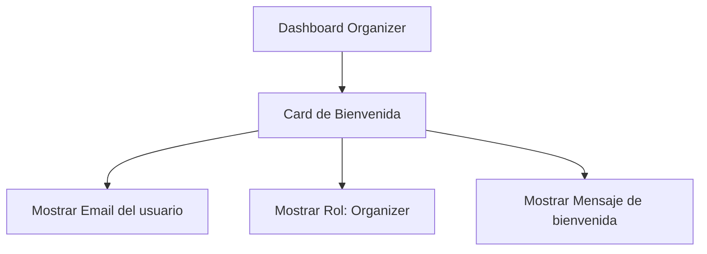

# Diagrama de Caso de Uso: Dashboard

## 1. Visualizar Estadísticas (Admin)

```mermaid
sequenceDiagram
    actor Admin as Administrador
    participant Dashboard as Dashboard.tsx
    participant DashboardService as dashboard.service.ts
    participant Backend as Backend API
    participant ReactQuery as React Query
    
    Admin->>Dashboard: Navegar a /admin
    Dashboard->>Dashboard: Verificar role === "admin"
    Dashboard->>ReactQuery: useQuery(["dashboard"])
    ReactQuery->>DashboardService: getStats()
    DashboardService->>Backend: GET /api/dashboard/stats
    
    Backend-->>DashboardService: { totalSales, totalOrders, activeProducts, categories, subcategories, lastOrders }
    DashboardService-->>ReactQuery: DashboardStats
    ReactQuery-->>Dashboard: Data cargada
    
    Dashboard->>Admin: Mostrar Cards de Estadísticas
    Dashboard->>Admin: Mostrar Tabla de Últimas Órdenes
```

## 2. Visualizar Dashboard (Organizer)

```mermaid
sequenceDiagram
    actor Organizer as Organizador
    participant Dashboard as Dashboard.tsx
    participant AuthStore as auth.store.ts
    
    Organizer->>Dashboard: Navegar a /admin
    Dashboard->>Dashboard: Verificar role === "organizer"
    Dashboard->>Dashboard: Decodificar token JWT
    Dashboard->>Dashboard: Extraer email del token
    Dashboard-->>Organizer: Mostrar Card de Bienvenida
    Note over Organizer,Dashboard: Muestra email y rol sin estadísticas
```

## Vista de Administrador

```mermaid
graph TD
    A[Dashboard Admin] --> B[Card Total Ventas]
    A --> C[Card Total Ordenes]
    A --> D[Card Productos Activos]
    A --> E[Card Categorias Subcategorias]
    A --> F[Tabla Ultimas 5 Ordenes]
    
    F --> G{Hay ordenes?}
    G -->|Si| H[Mostrar datos con Tags de estado]
    G -->|No| I[Sin ordenes]
    
    B --> J[Mostrar Total Ventas]
    C --> K[Mostrar Numero]
    D --> L[Mostrar Numero]
    E --> M[Mostrar X Y]
```

## Vista de Organizador

```mermaid
graph TD
    A[Dashboard Organizer] --> B[Card de Bienvenida]
    B --> C[Mostrar Email del usuario]
    B --> D[Mostrar Rol: Organizer]
    B --> E[Mostrar Mensaje de bienvenida]
```

