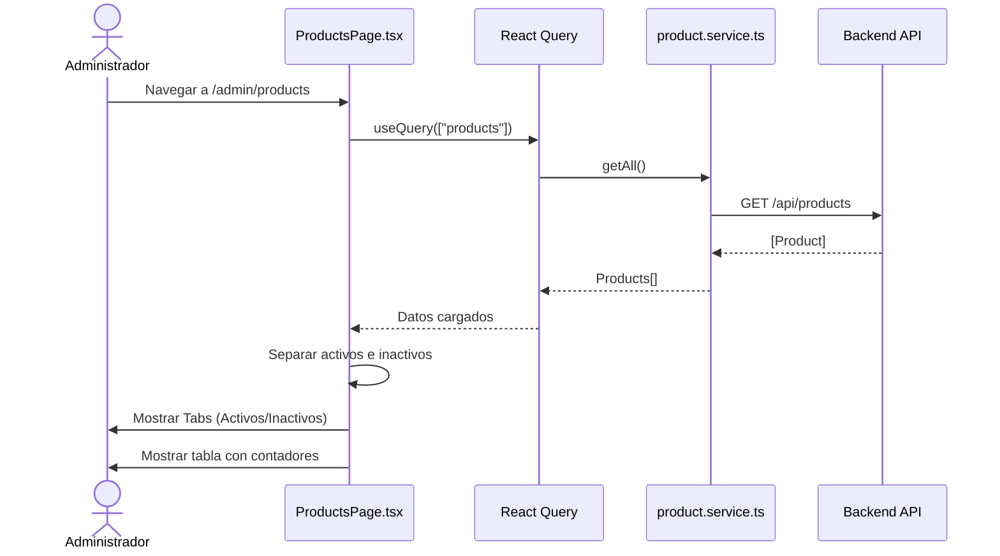
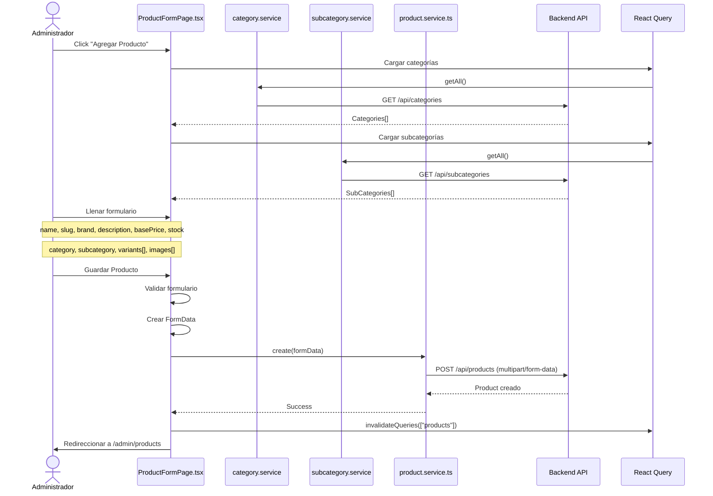
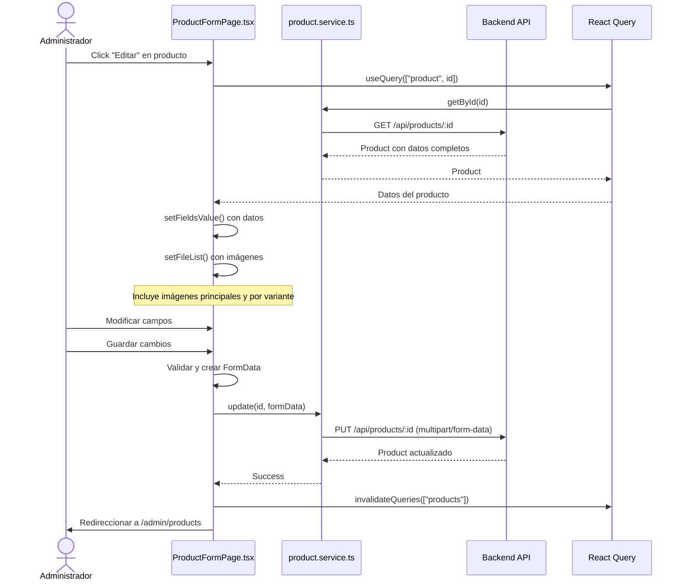
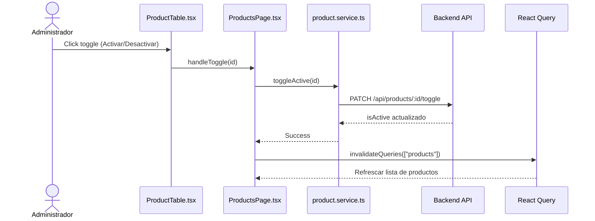
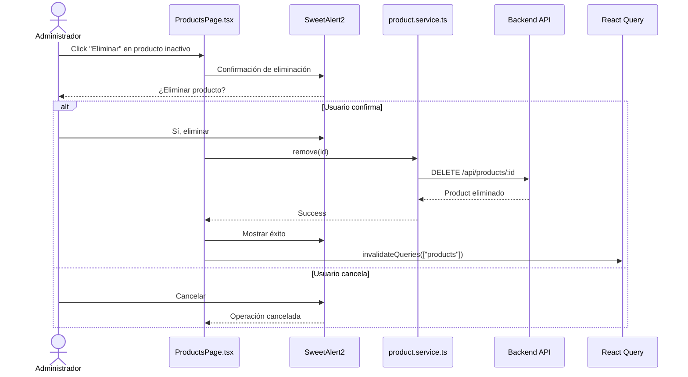
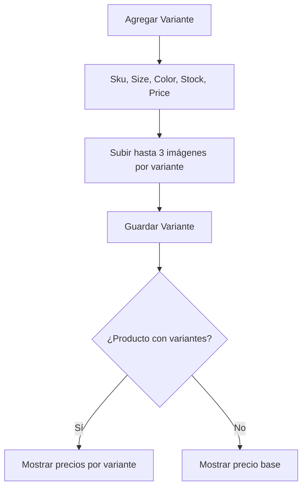

# Diagrama de Caso de Uso: Gestión de Productos

## 1. Listar Productos

## 2. Crear Producto

## 3. Editar Producto

## 4. Activar/Desactivar Producto

## 5. Eliminar Producto (Permanente)

## Flujo de Variantes

