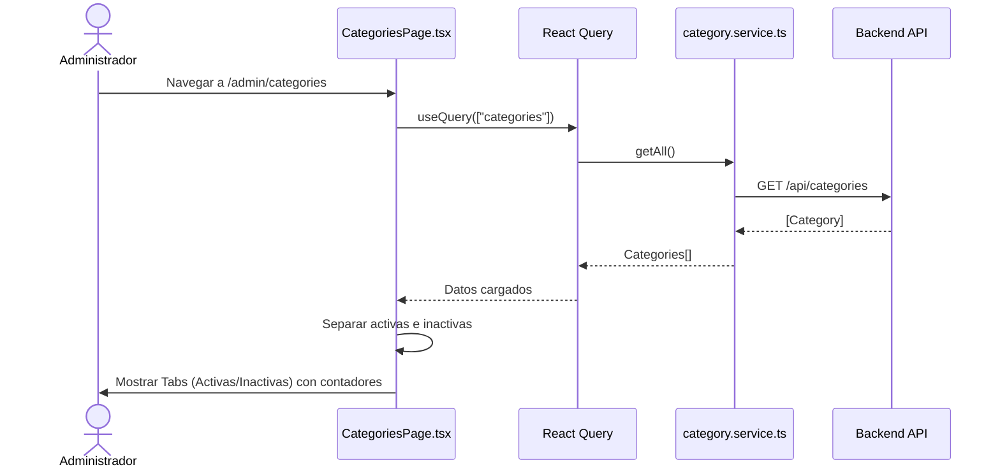
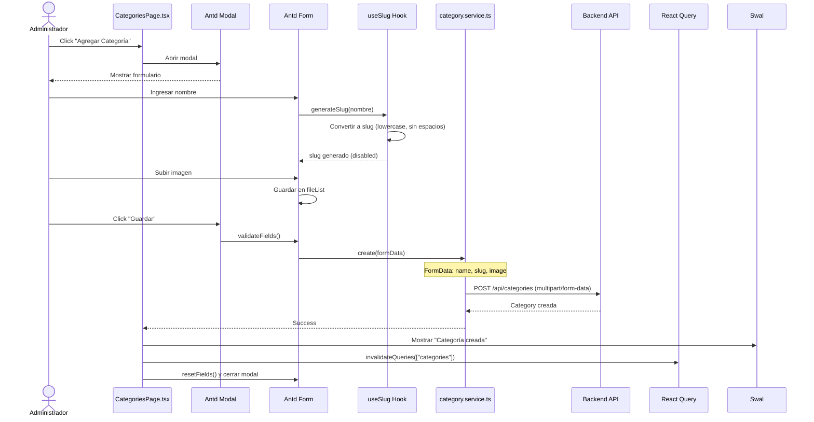
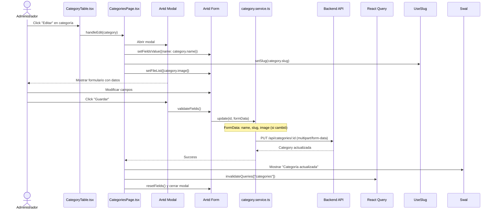
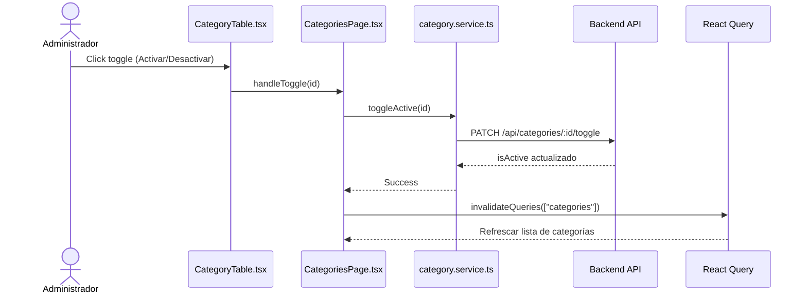
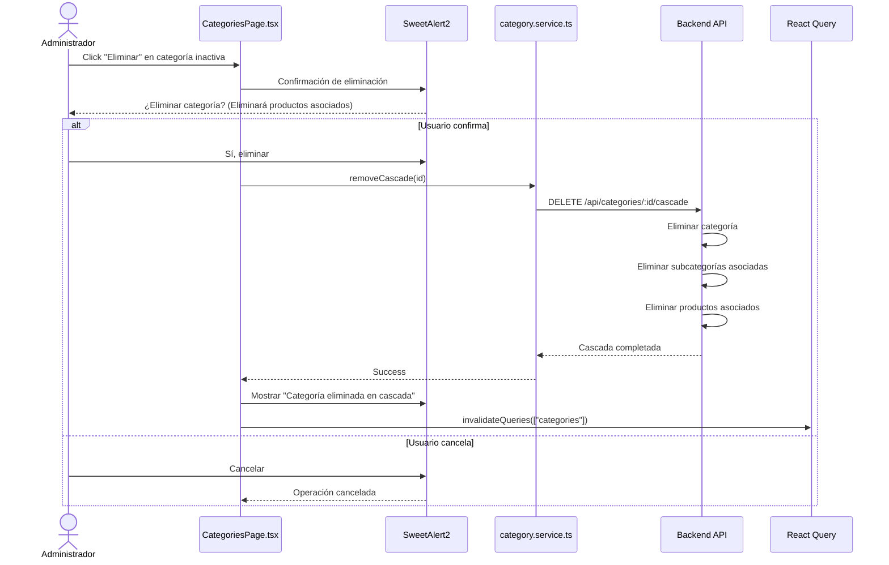
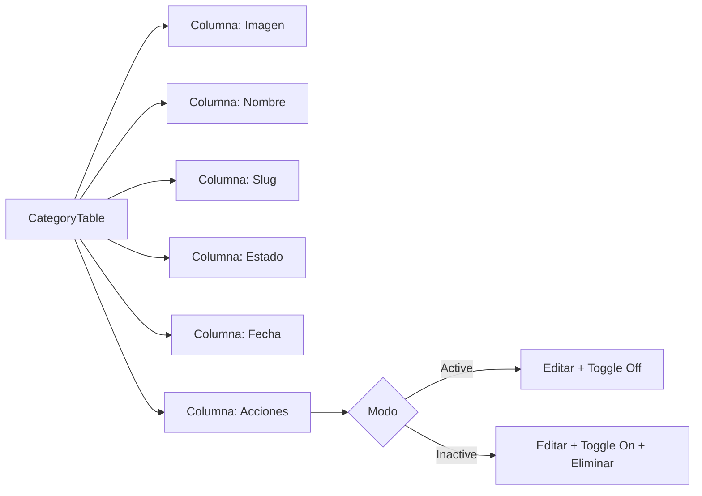

# Diagrama de Caso de Uso: Gestión de Categorías

## 1. Listar Categorías



## 2. Crear Categoría



## 3. Editar Categoría



## 4. Activar/Desactivar Categoría



## 5. Eliminar Categoría en Cascada



## Vista de Categorías

```mermaid
graph TD
    A[Categorías Page] --> B[Header: Categorías + Botón Agregar]
    B --> C[Tabs]
    
    C --> D[Tab Activas]
    D --> E[Tag Verde con contador]
    E --> F[CategoryTable - Solo activas]
    
    C --> G[Tab Inactivas]
    G --> H[Tag Rojo con contador]
    H --> I[CategoryTable - Solo inactivas]
    
    F --> J[Editar | Desactivar]
    I --> K[Editar | Activar | Eliminar Cascada]
```

## Tabla de Categorías



