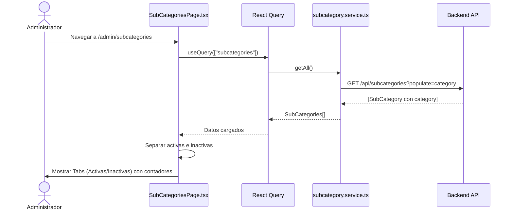
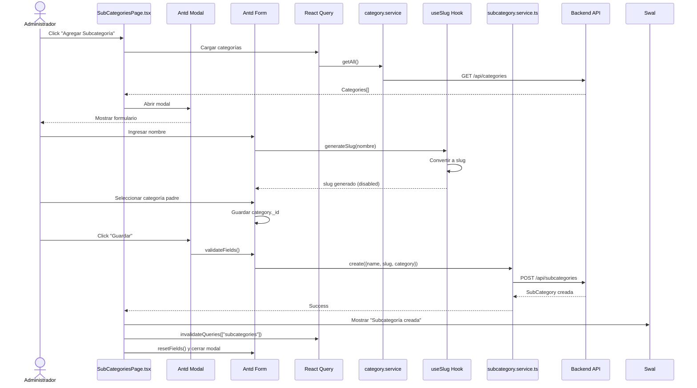
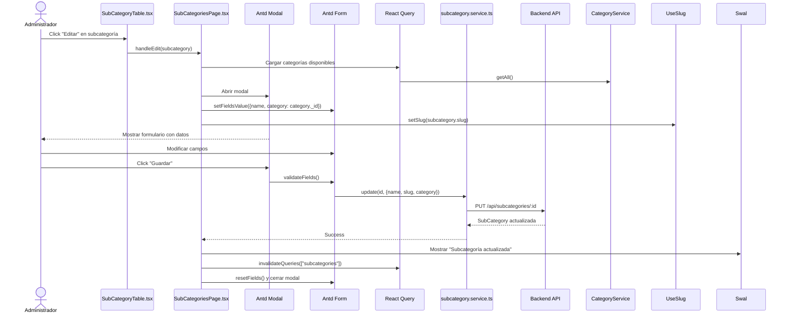
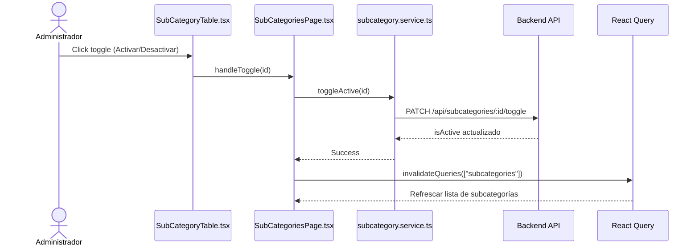
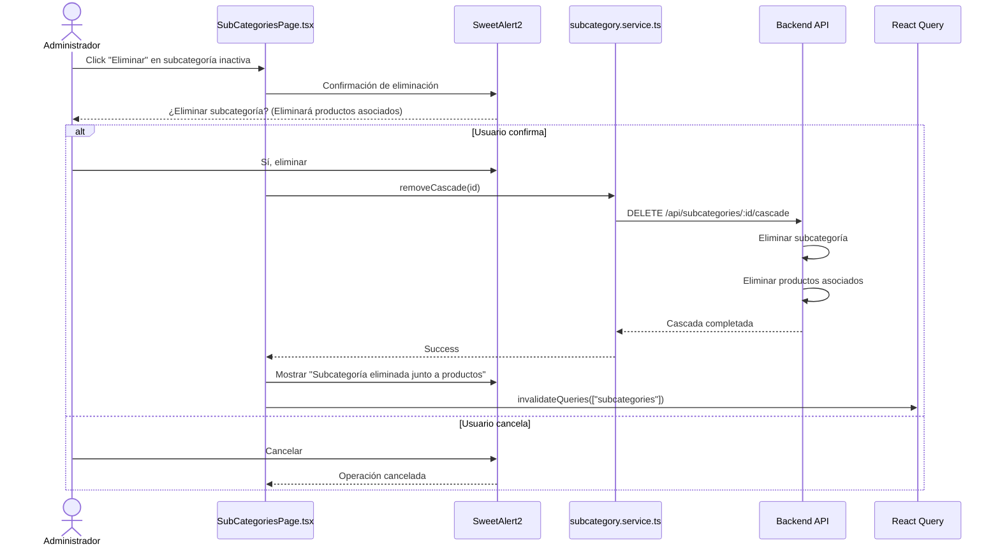
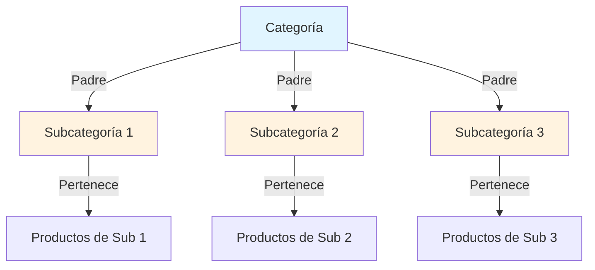
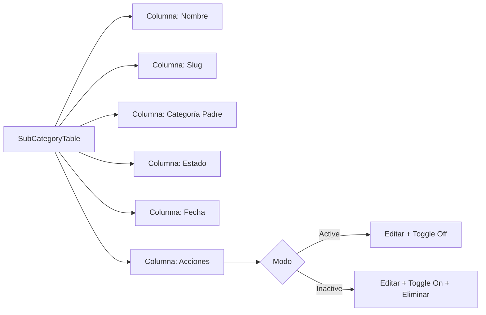

# Diagrama de Caso de Uso: Gestión de Subcategorías

## 1. Listar Subcategorías



## 2. Crear Subcategoría



## 3. Editar Subcategoría



## 4. Activar/Desactivar Subcategoría



## 5. Eliminar Subcategoría en Cascada



## Relación Categoría-Subcategoría



## Vista de Subcategorías

```mermaid
graph TD
    A[Subcategorías Page] --> B[Header: Subcategorías + Botón Agregar]
    B --> C[Tabs]
    
    C --> D[Tab Activas]
    D --> E[Tag Verde con contador]
    E --> F[SubCategoryTable - Solo activas]
    
    C --> G[Tab Inactivas]
    G --> H[Tag Rojo con contador]
    H --> I[SubCategoryTable - Solo inactivas]
    
    F --> J[Editar | Desactivar]
    I --> K[Editar | Activar | Eliminar Cascada]
```

## Tabla de Subcategorías



