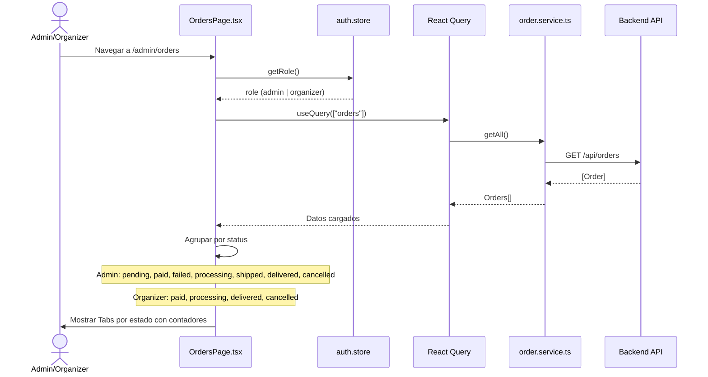
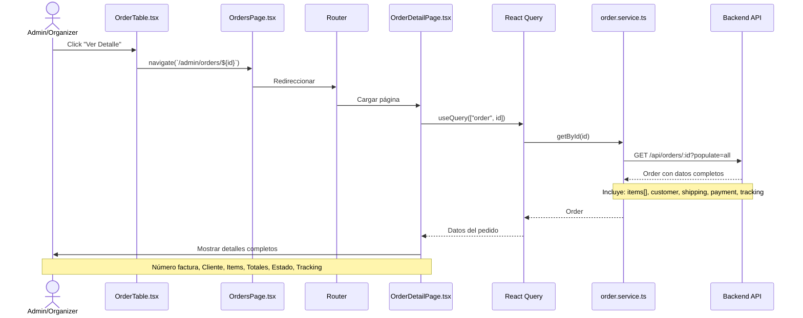
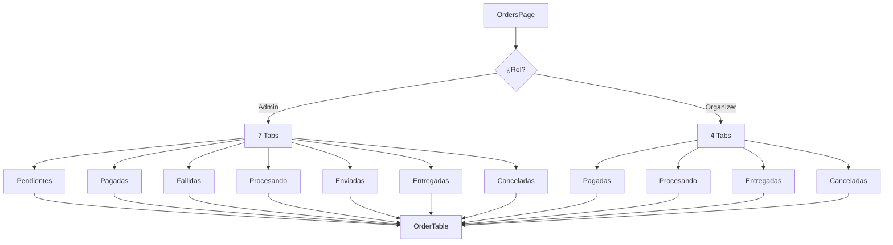
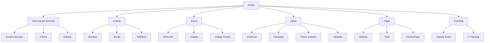
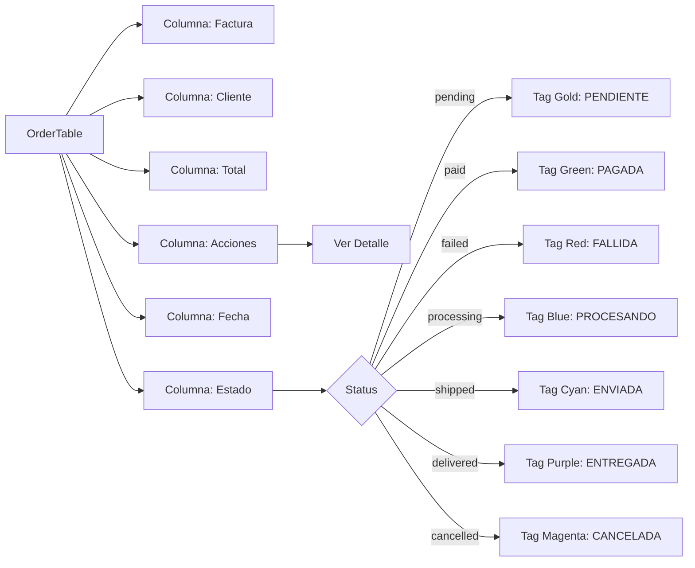
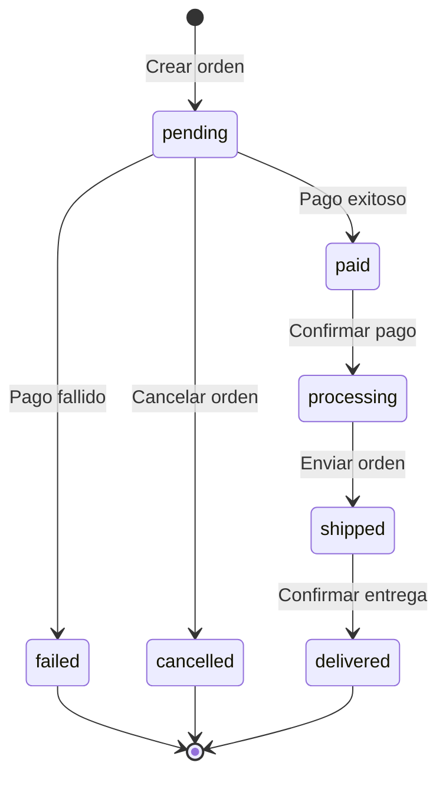

# Diagrama de Caso de Uso: Gestión de Órdenes

## 1. Listar Órdenes (Según Rol)

## 2. Ver Detalle de Orden

## Vista de Órdenes por Rol

## Estructura de Orden

## Tabla de Órdenes

## Flujo de Estados de Orden

