# Diagrama de Caso de Uso: Gestión de Contactos

## 1. Listar Contactos

## 2. Ver Detalle de Mensaje

```mermaid
sequenceDiagram
    actor Usuario as Admin/Organizer
    participant ContactPage as ContactPage.tsx
    participant Modal as Antd Modal
    
    Usuario->>ContactPage: Click "Ver Detalle"
    ContactPage->>ContactPage: setSelectedContact(record)
    ContactPage->>ContactPage: setModalVisible(true)
    ContactPage->>Modal: Abrir modal
    
    Modal-->>Usuario: Mostrar información completa
    Note over Modal,Usuario: Nombre, Email, Asunto, Mensaje, Fecha, Estado
```

## 3. Marcar como Revisado

```mermaid
sequenceDiagram
    actor Usuario as Admin/Organizer
    participant ContactPage as ContactPage.tsx
    participant ContactService as contact.service.ts
    participant Backend as Backend API
    
    Usuario->>ContactPage: Click "Marcar como revisado"
    ContactPage->>ContactService: markAsReviewed(id)
    ContactService->>Backend: PATCH /api/contacts/:id/review
    
    Backend-->>ContactService: status actualizado a "reviewed"
    ContactService-->>ContactPage: Success
    
    ContactPage->>ContactPage: Actualizar estado local
    Note over ContactPage: setContacts(prev => prev.map(c => c._id === id ? {...c, status: "reviewed"} : c))
    
    ContactPage-->>Usuario: Mostrar mensaje de éxito
```

## 4. Eliminar Contacto

```mermaid
sequenceDiagram
    actor Usuario as Admin/Organizer
    participant ContactPage as ContactPage.tsx
    participant Swal as SweetAlert2
    participant ContactService as contact.service.ts
    participant Backend as Backend API
    
    Usuario->>ContactPage: Click "Eliminar"
    ContactPage->>Swal: Confirmación de eliminación
    Swal-->>Usuario: ¿Eliminar mensaje?
    
    alt Usuario confirma
        Usuario->>Swal: Sí, eliminar
        Swal-->>ContactPage: isConfirmed = true
        ContactPage->>ContactService: delete(id)
        ContactService->>Backend: DELETE /api/contacts/:id
        
        Backend-->>ContactService: Contact eliminado
        ContactService-->>ContactPage: Success
        ContactPage->>ContactPage: Actualizar lista local
        Note over ContactPage: setContacts(prev => prev.filter(c => c._id !== id))
        ContactPage-->>Usuario: Mostrar mensaje de éxito
    else Usuario cancela
        Usuario->>Swal: Cancelar
        Swal-->>ContactPage: Operación cancelada
    end
```

## Notificaciones en Tiempo Real

```mermaid
sequenceDiagram
    actor Cliente as Cliente Web
    participant Backend as Backend API
    participant Socket as Socket.IO Server
    participant SocketClient as Socket.IO Client
    participant ContactPage as ContactPage.tsx
    participant Notification as Antd Notification
    participant AdminLayout as AdminLayout.tsx
    
    Cliente->>Backend: POST /api/contacts
    Backend->>Socket: Emitir "new_contact"
    Socket-->>SocketClient: Evento "new_contact"
    
    SocketClient->>AdminLayout: Recibir evento
    AdminLayout->>Notification: Mostrar notificación
    Note over Notification: "📩 Nuevo mensaje de contacto: {nombre}"
    
    AdminLayout->>AdminLayout: setPendingCount(prev => prev + 1)
    
    alt Admin navega a ContactPage
        AdminLayout->>ContactPage: Cargar página
        ContactPage->>ContactService: getAll()
        ContactService->>Backend: GET /api/contacts
        Backend-->>ContactPage: Lista actualizada con nuevo contacto
    end
```

## Badge de Contador en Menú

```mermaid
graph TD
    A[AdminLayout] --> B[Sidebar Menu]
    B --> C[Item: Contactos]
    C --> D{¿pendingCount > 0?}
    
    D -->|Sí| E[Mostrar Badge Rojo]
    E --> F[Texto: pendingCount]
    
    D -->|No| G[Sin Badge]
    
    H[Socket Event] --> I{Evento?}
    I -->|new_contact| J[Incrementar contador]
    I -->|contact_reviewed| K[Decrementar contador]
    
    J --> D
    K --> D
```

## Vista de Contactos

## Tabla de Contactos

## Estructura de Contacto

