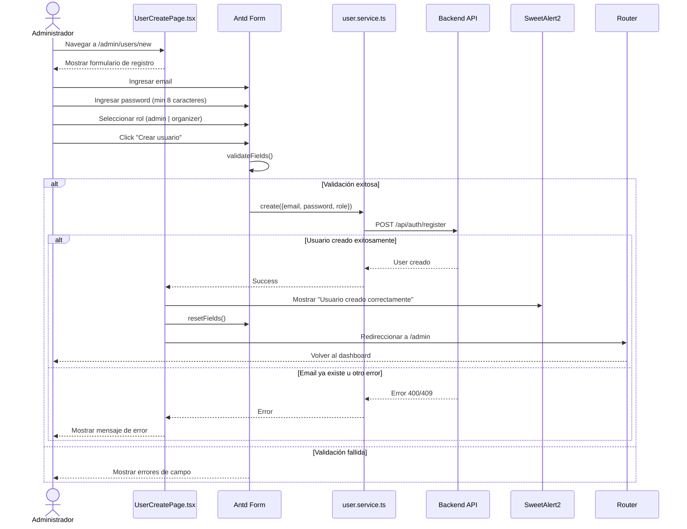
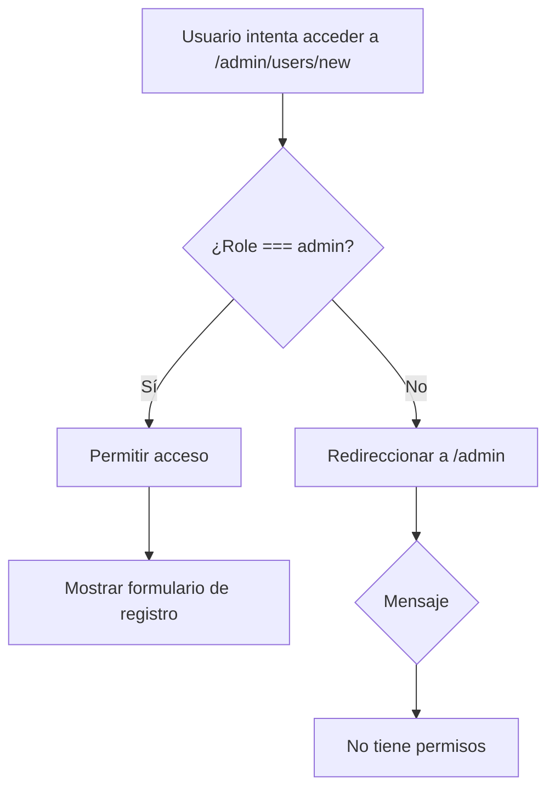
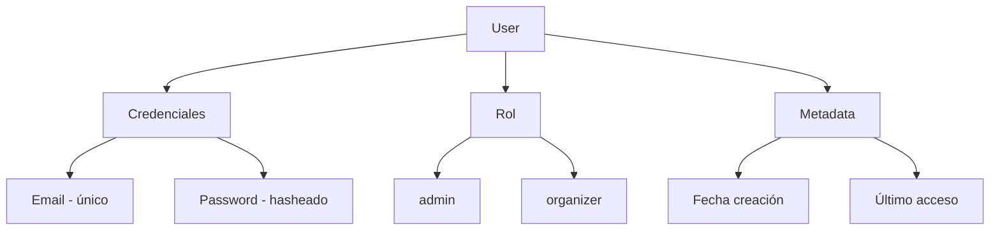
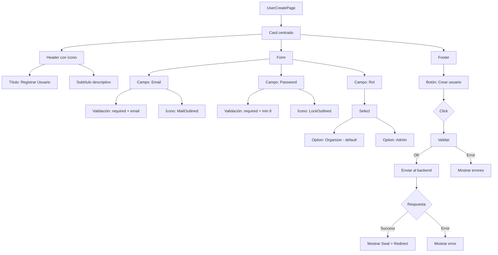
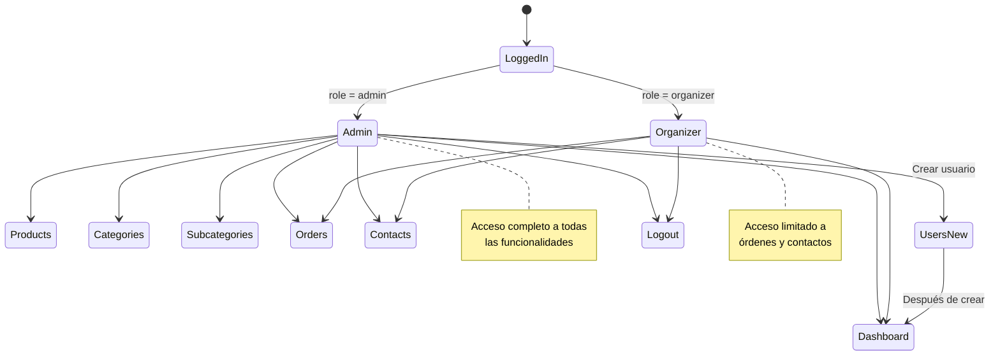
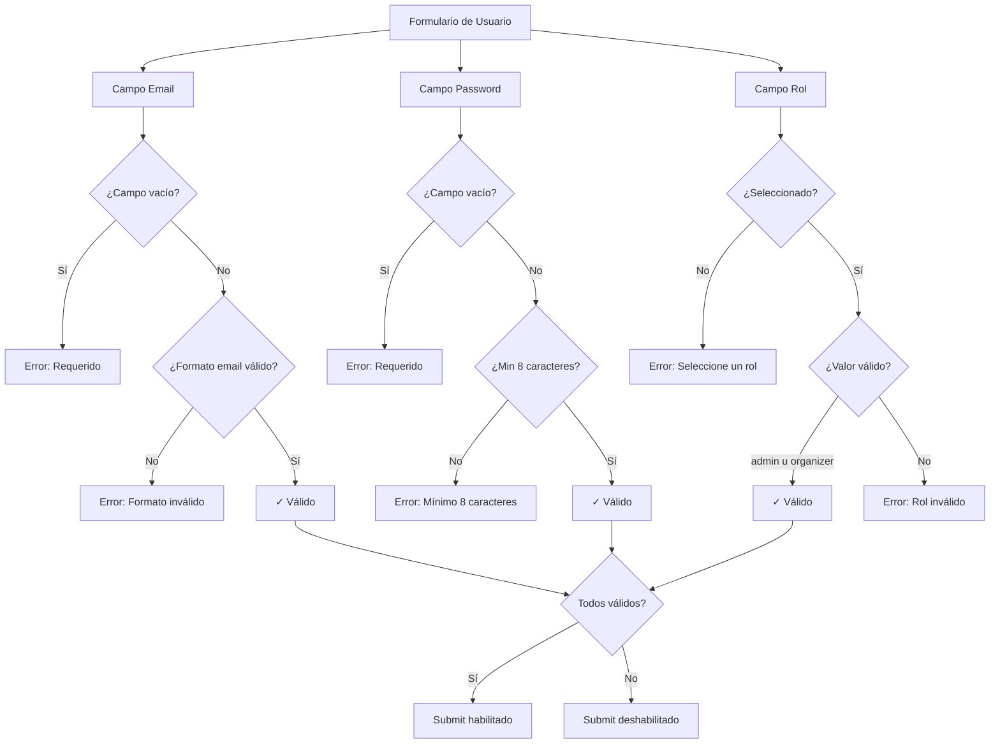

# Diagrama de Caso de Uso: Gestión de Usuarios

## 1. Crear Usuario (Solo Admin)

## Restricciones de Acceso

## Estructura de Usuario

## Formulario de Registro

## Flujo de Permisos por Rol

## Validaciones de Formulario

